## Description

The implementation consists in returning all requests to a /setup page as long as no administrator has been created on the platform.

This feature allows you to securely set a password on the Extract platform, without it being predefined in the code or in an external configuration file.

## Overview

The idea is to redirect all requests to the `/setup` page until a specific condition is met. This condition is that there is an administrator user in the database.

```mermaid
%%{init: {'theme': 'default', 'themeVariables': { 'sequenceDiagramWidth': '600px', 'sequenceDiagramHeight': '800px' }}}%%
sequenceDiagram
    participant U as User
    participant SF as SetupRedirectFilter
    participant SC as SecurityConfiguration
    participant CT as SetupController
    participant US as UserService

    U->>SF: HTTP request
    SF->>SF: appInitializationService.isConfigured()
    SF->>SF: Verifying the configuration
    alt Application is not configured
        SF->>U: Redirecting to /setup
    else Application is configured
        alt Request for /setup
            SF->>CT: denyUnlessAdminUserIsNotCreated
        else Request for others
            SF->>SC: Registering the filter
            SF->>SC: Configuring paths (exclusions)
            U->>SF: Requête GET/POST
            SF->>CT: Validation and handling data
            CT->>US: Create the user
        end
    end

```



The `SetupRedirectFilter` is responsible for letting in all the requests through the `FilterChain` as long as an administrator is set up. If that's not the case, the filter must redirect all requests to `/setup` or let static resources through.

> [!warning]
> Javascript resources muse be treated as a special case, because only the whitelisted resources shall be allowed through, because some JS files should only be downloaded with appropriate permissions. If we do not use whitelisting, an attacker might access forbidden resources.
## Configuration

To enable redirection to `setup`, we had to allow all unauthenticated calls to this page. This is done by modifying the `SecurityConfiguration` configuration:

```diff
.exceptionHandling((exceptions) -> exceptions  
        .accessDeniedPage("/forbidden")  
)  
.authenticationManager(new ProviderManager(List.of(daoAuthenticationProvider,  
                                                   ldapAuthenticationProvider)))  
+.addFilterBefore(setupRedirectFilter,UsernamePasswordAuthenticationFilter.class);
```

However, for security reasons, it is necessary to allow redirection only as long as an administrator has not been created. Once created, all access to the `/setup` page is forbidden:

```java
private void denyUnlessAdminUserIsNotCreated() {  
    if (appInitializationService.isConfigured()) {  
        throw new SecurityException("This page cannot be accessed !");  
    }  
}
```
