## User administration

### Users list
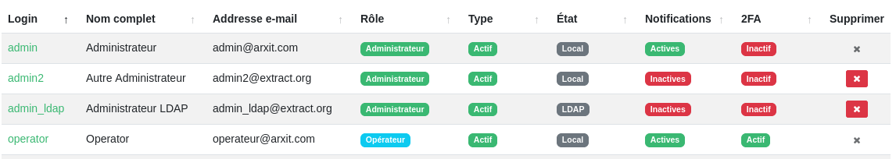{width="1000"}

This page lists all users, whether active or inactive. You can:

* **create a new user** by clicking on the ``Nouvel utilisateur`` button
* **manage user groups** by clicking on the ``Groupes`` button
* **edit a user** by clicking on their login
* **delete a user** by clicking on the red button with a cross. It is not possible to delete (grayey out button):
    * Your own account
    * A user directly associated with a process
    * The last active user of a group associated with a process

It includes a filtering feature based on the following criteria:

* Text search (partial and case insensitive) in the following fields:
    * Login
    * Name
    * Email address

* User's role
* User's state
* User's notifications status
* User's 2FA status

The search is executed only when you click the green **search button** (magnifying glass icon). Alternatively, you can start the search by pressing **Enter** while focused on a search field.

### User settings
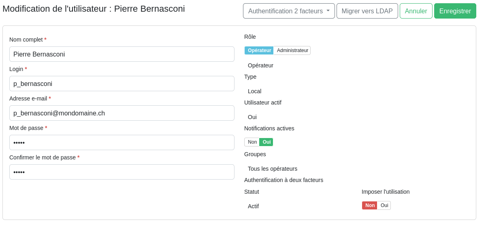{width="1000"}

User's settings are:

* User's full name (for display purposes)
* User's role in the application (operator or administrator). It is not possible to change the role of your own account
* The username they use to log in (must be unique within the application)
* Whether the user is active. An inactive user cannot log in to the application. It is not possible to deactivate the account of a user associated with a process.
* The email address to which notifications concerning them will be sent
* Whether email notifications are enabled. Only operator-type notifications are affected. Even if notifications are deactivated, the user will continue to receive emails allowing them to reset their password. All notifications for administrators are not affected by this setting.
* The password they use to log in. If the password is changed, it must follow the password policy.
* Whether two-factor authentication should be required for the user. In this case, the user will have to register with Google Authenticator (or compatible) the next time they log in, without the option to cancel the registration. If you choose not to require two-factor authentication, the user can still choose to enable it.
* User language preference (if Extract is in multilingual mode)

 
Using the buttons at the top of the page, administrators can:

* Manage the status of two-factor authentication for the user, i.e. enable it, disable it, or ask the user to register again with a new code. This is a drop-down button that displays a menu when clicked, showing the actions available depending on the user's status
* In the case of a local user and if LDAP is enabled, the administrator can choose to migrate the user to an LDAP user. The password to be used then becomes the one defined in the company directory. **Warning**: this operation cannot be reversed.

 
These operations will result in the loss of any other changes currently in progress.

If the user is an LDAP user, the only changes available in Extract are:

* Email notifications status
* Two-factor authentication status (including the option to enforce it or not)
* User language preference (if Extract is in multilingual mode)

### Users groups
User groups allow operators to be grouped together to be assigned to a process as a group. Group settings are accessed from the user list.

#### Groups list
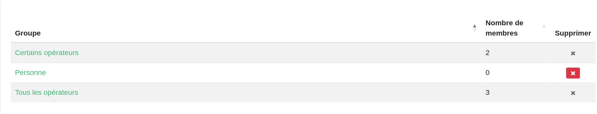{width="1000"}

This page lists all users groups with their number of users (active or inactive). Following actions are possible:

* **Create a new group** by clicking on the `Nouveau groupe` button 
* **Edit a group** by clicking on its name
* **Delete a group** by clicking on the red button with a cross. It is not possible to delete a group associated with a process (grayed out button)

#### Groups settings
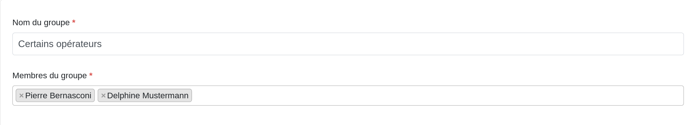{width="1000"}

Group settings are:

* Group name (mandatory and unique)
* The list of users it contains. A user can belong to several groups. For groups associated with a process users can be added or removed, but there must always be at least one active user remaining.

## Processes
A process is a sequence of tasks that generates the data requested by a client.

### Processes list
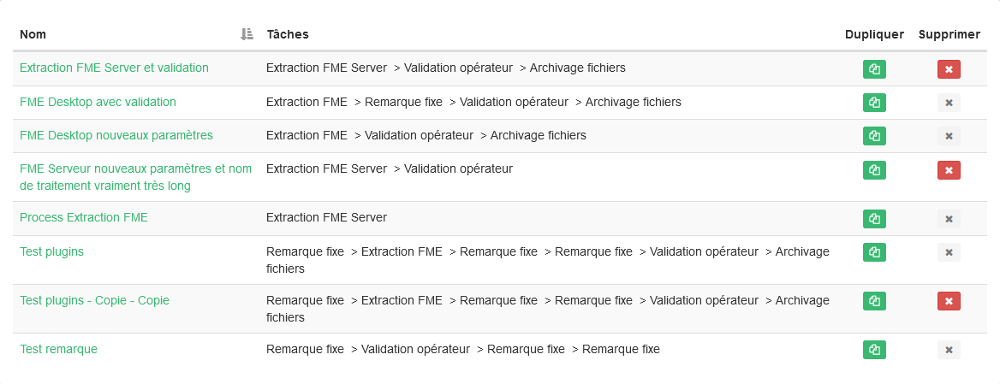{width="1000"}

This page lists all processes whether or not they are associated with a rule. Following actions are available:

* **Create a process** by clicking on the `Nouveau traitement` button
* **Edit a process** by clicking on its name
* **Duplicate a process** by clicking on the green button with a copy icon. An identical copy of the process will be created, including its tasks and settings.
* **Delete a process** by clicking on the red button with a cross. Processes associated with a request that is not completed or associated with a connector's rule cannot be deleted (grayed out button).

It includes a filtering feature based on the name of the process. The search is executed only when you click the green **search button** (magnifying glass icon). Alternatively, you can start the search by pressing **Enter** while focused on the search field.

### Process details

#### Process parameters
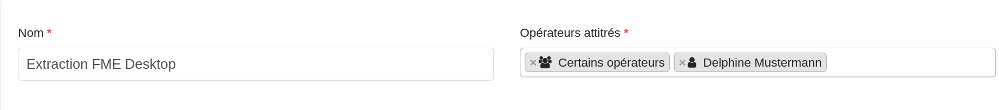{width="1000"}

At the top of the page, the following are defined:

* The name to be given to the process in the application
* The users or user groups authorized to interact with requests associated with this process. At least one operator or user group must be specified. Administrators can interact with all requests.

#### Process tasks
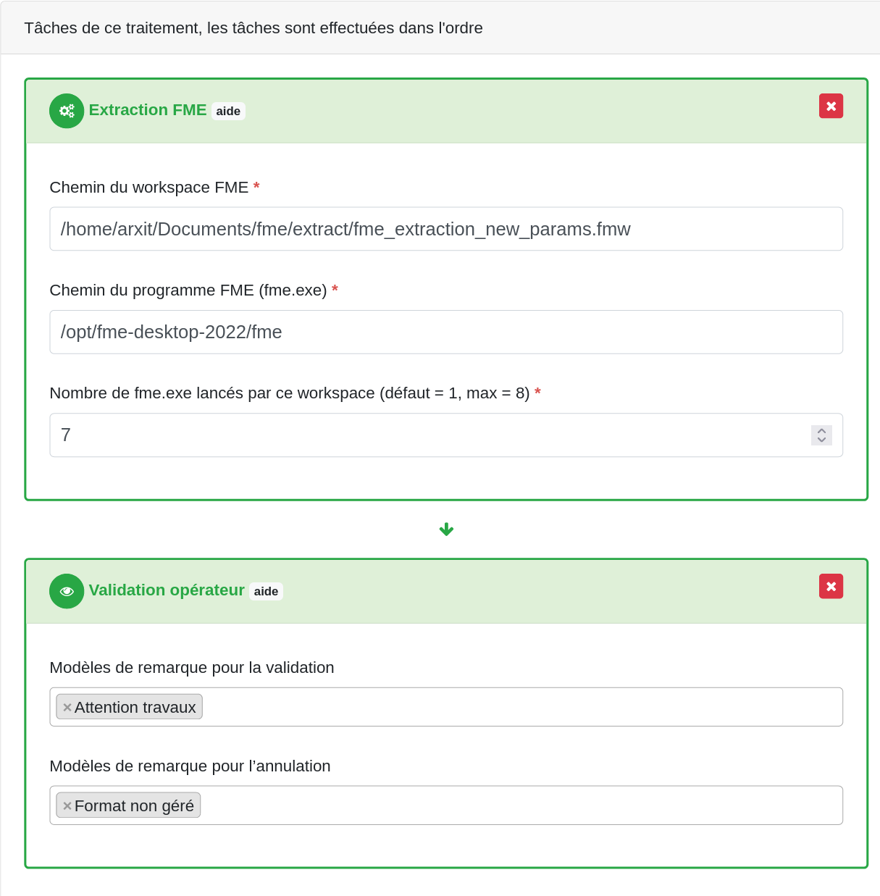{width="600"}

The tasks currently configured for the process are displayed in the order in which they will be executed. You can change the order of the tasks by dragging and dropping the task. Each task can be deleted by clicking on the red button with a cross.

Depending on the task type, the following items may be displayed:  

* Configuration parameters  
* A button to display help text

!!! Warning 
    It is strongly recommended not to delete or reorder tasks in a process that has running requests. Result may be unpredictable. However, it is always possible to modify the parameters.

#### Available tasks
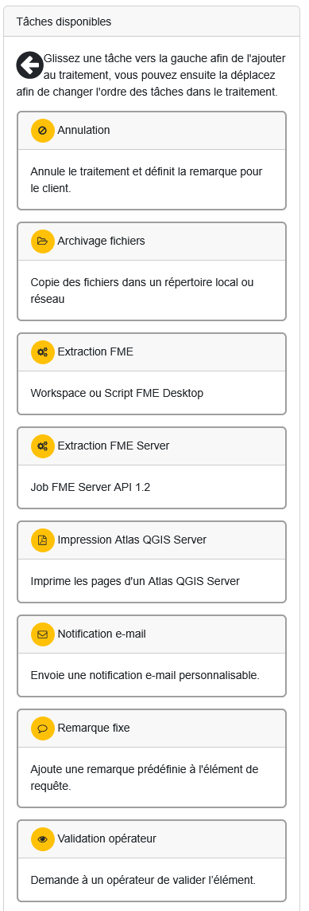{width="350"}

On the right side of the screen is a list of available task with a brief description. To add a task to the process, drag and drop one of these items to the area on the left. If necessary, you can add the same task several times.

## Connectors
Connectors allow you to retrieve requests from a server and send the results back to it.

### Connectors list
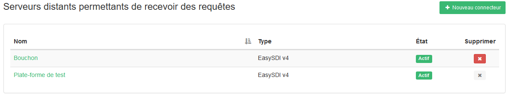{width="1000"}

This page lists all defined connectors, whether active or not. Following actions are available:

* **Create** a new connector by clicking the ``Nouveau connecteur`` button, then choosing a server type from the drop-down list
* **Edit** a connector by clicking on its name
* **Delete** a connector by clicking the red button with the cross. It is not possible to delete a connector with running requests (grayed out button).

It includes a filtering feature based on the name of the process and the connector's type. The search is executed only when you click the green **search button** (magnifying glass icon). Alternatively, you can start the search by pressing **Enter** while focused on the search field.

### Connector details

#### Connector parameters
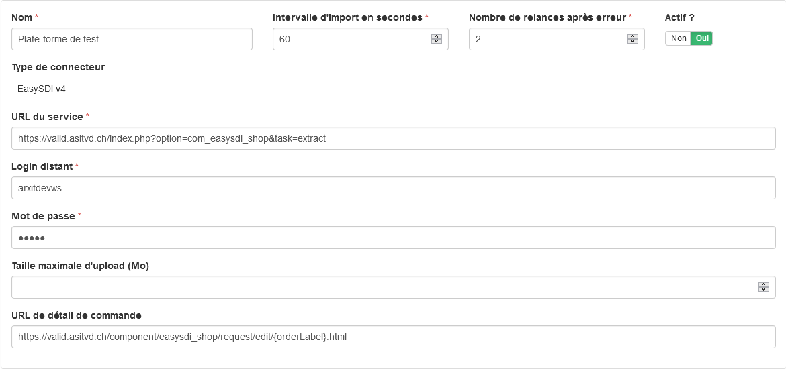{width="1000"}

Generic parameters for all server types are as follows:

* The name to give to the connector in the application
* The number of seconds between two attempts to retrieve requests
* The number of retries to perform in case of an import problem before setting the connector to error
* Whether or not to activate the connector. This setting only applies to imports. The result can be exported even when the connector is deactivated.
* The type of connector to use (non-editable)

In addition, each type of connector can define specific parameters. For easySDI v4 connector, these are:  

* The service address used to retrieve requests and return their results
* The username and password to connect to the service
* The maximum file size to be exported as a result of the request. Leave this parameter blank for no size limit
* The URL template for viewing the details of a request on the origin server. This parameter can be left blank, in which case the view link will not be displayed on the request details page. 

    The following variables can be specified between curly brackets. They will be replaced with the properties of the relevant request.

    | Variable   | Value                              |
    | ----------- | ------------------------------------ |
    | `client`  | Client name who placed the order |
    | `orderGuid` | The GUID that identifies the order |
    | `orderLabel`  | The order number |
    | `organism` | The organization of the client who placed the order |
    | `productGuid`  | The GUID that identifies the product ordered |
    | `productLabel` | The name of the product ordered |

#### Connector rules
{width="1000"}

Rules allow you to assign a process to a request. Rules are executed from top to bottom. The first active rule whose conditions are met triggers the assigned process, following rules are ignored. Therefore, it's best to place most specific requests first. If no rule matches the request, administrators are notified by email.

You can create a new rule by clicking on the ``Ajouter une règle`` button and delete one by clicking on the red button with a cross. You can also change the rules order by dragging and dropping them.

Following rule parameters are available:

* The code defining the rules that link a request to its processing. For details on the required syntax, click the help button in the column header.
* The process to be associated with the request if the rule matches
* Whether the rule is active (inactive rules are ignored)

!!! Info 
    The code defining the rules is limited to 65'000 characters by default. It's possible to remove this limitation by changing the type of the rule field in the database (see [Rule field size limitation](../../getting-started/configure#rule-field-size-limitation-matching-processes))

!!! Info 
    Rule management is not available when creating a connector. You must first save it, then edit it.

## Application settings

### Orchestration
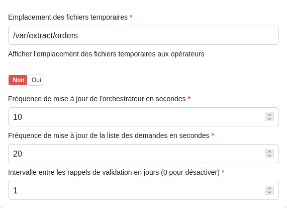{width="500"}

* **Storage path** : Defines the directory where files generated during request processing are stored. Tomcat user must have both read and write permissions for this directory. Data related to a request are automatically deleted once the request is successfully exported.
* **Show temporary file location to operators** : When enabled, the system displays the path of the temporary processing directory on the request details page.
* **Orchestrator update frequency** : Specifies the interval (in seconds) between executions of background tasks, such as: request processing, rule matching, data export. Notes :
    * A lower value makes tasks more responsive but increases server resource usage.
    * It also represents the maximum delay before connector setting changes take effect.
    * This setting does not affect request imports frequency, which are controlled in each connector’s properties (see [Connector parameters](#connector-parameters)).
* **Request list update frequency** : Defines how often (in seconds) the home page data is refreshed (see [Requests list](../user-guide#requests-list))
* **Interval between validation reminders** : Specifies the number of days between two email reminders sent to operators when a request is still pending validation. Set this value to 0 to disable reminders.

### Operating hours
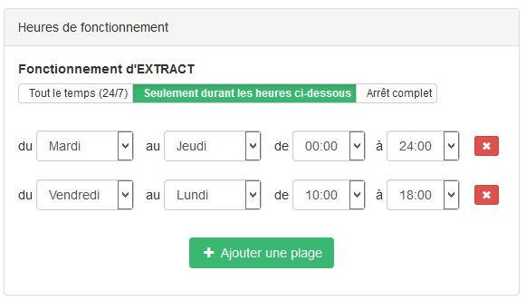{width="500"}

This section lets you define the time windows during which Extract automatically runs its tasks (import, processing, export, etc.) Regardless of the selected operating mode, you can always log in to the application to perform manual actions such as: Validating requests, modifying processed files, updating application settings, resetting passwords, etc.

You can define operating time slots by clicking on the ``Ajouter une plage`` button. The days and times indicated are included in the time slot. If several time slots are defined, automatic tasks will run whenever at least one slot covers the current day and time. You can also delete a time slot by clicking the red Delete button next to it.

Time slots can be defined at any time, but they are only applied if the operating mode ``Seulement durant les heures ci-dessous`` is selected. If this mode is chosen but no slot is defined, the system behaves the same as in ``Arrêt complet`` mode.

### SMTP server
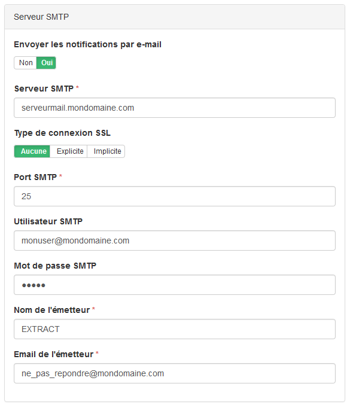{width="500"}

This section covers the configuration of server settings for email notifications.

* **SMTP User**: Used to authenticate with the SMTP server.
* **Sender Details**: You can specify both the sender’s name and email address. Depending on the server’s policy, these may differ.

### LDAP authentication
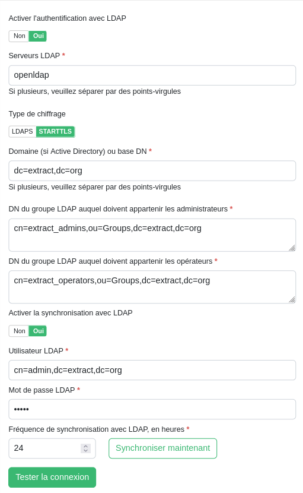{width="500"}

This section lets you enable and configure LDAP login using your corporate directory. You can specify:

* **LDAP servers**: Enter the server name(s) and port(s) (optional). If multiple servers are used, separate them with semicolons.
* **Encryption type**: Choose the security protocol for connections.
* **Domain or base DNs**: For Active Directory, enter the domain. For other LDAP servers, provide one or more base DNs (separated by semicolons).
* **Group DN**: Define the DN of the group whose members will be assigned roles in Extract.
    * Members of the operator group will be assigned the Operator role.
    * Members of the administrator group will be assigned the Administrator role.
    * If a user belongs to both groups, they will be considered an Administrator.

#### Synchronization with LDAP

Extract can automatically run a task to keep LDAP users and their attributes up to date. To enable synchronization, you’ll need to provide the username and password of an LDAP account with read permissions and the synchronization interval (in hours).

During each synchronization, Extract will:

* **Deactivate** users who are no longer present in the directory or who have been disabled (in the case of Active Directory)
* **Update** existing LDAP users’ email addresses, full names, and roles if they have changed
* **Create** new Extract accounts for users who belong to an LDAP administrator or operator group but do not yet exist in Extract

You can start synchronization immediately (in the background) by clicking the ``Synchroniser maintenant`` button. Otherwise, synchronization is performed using the settings saved in the database. Please save your settings beforehand if you have modified them.

!!! Info 
    If a user is disabled or deleted in the LDAP directory, they will no longer be able to connect to Extract, even if synchronization has not been performed.

#### LDAP connection test

The ``Tester la connexion`` button lets you verify whether the current settings can successfully establish a connection. The test runs with the values you’ve entered, even if they haven’t been saved yet.

* If synchronization is enabled, the test uses the provided username and password.
* If synchronization is disabled, the test runs anonymously.

### Request validation
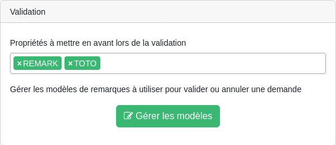{width="500"}

This section lets you specify which request properties should be highlighted for operators in the request validation area (see [Validation in the user guide](../user-guide#validation)). No syntax checks is applied to the properties entered here — only properties that actually exists in the request will be considered.

Additionally, this section provides access (by clicking on the `Gérer les modèles` button) to the management of predefined comment templates used during request validation steps.

#### Validation comment templates list
{width="1000"}

This page lists all existing message templates. Following action are available:

* **Create a new validation message** by clicking on the `Nouveau message` button
* **Edit a message** by clicking on its title
* **Delete a message** by clicking on the red button with a cross. It is not possible to delete a message associated with a validation task of a process (grayed out button).

#### Validation comment template details
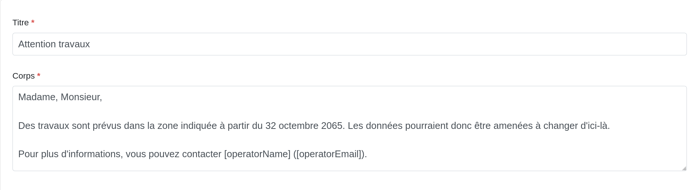{width="1000"}

Message parameters are:

* Its title (for display in the validation plugin settings and in the list of comments available during validation)
* Message text. The strings ``[operatorName]`` and ``[operatorEmail]`` will be replaced by the name and email address of the operator who validated the process.

### Miscellaneous information
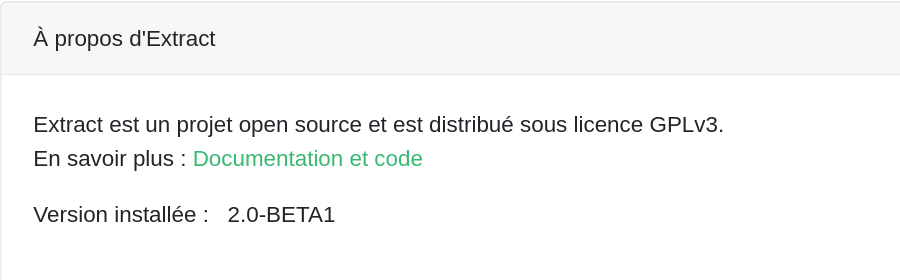{width="500"}

This section provides general information about Extract, including the application version installed.

 
 
 
 
 