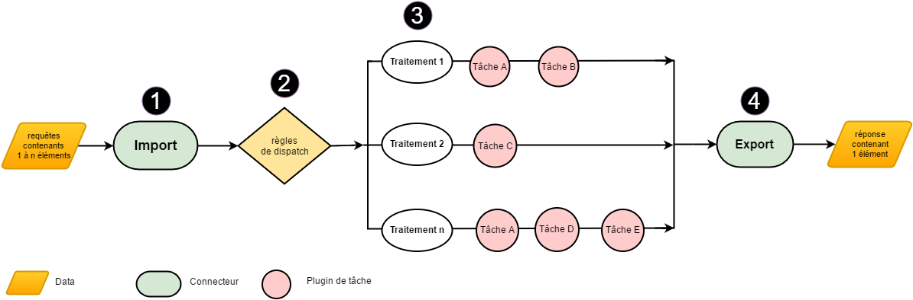
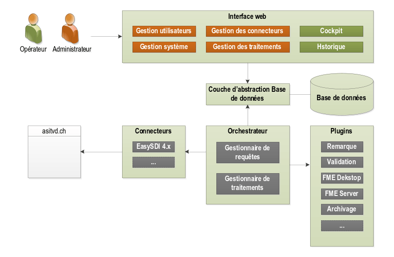
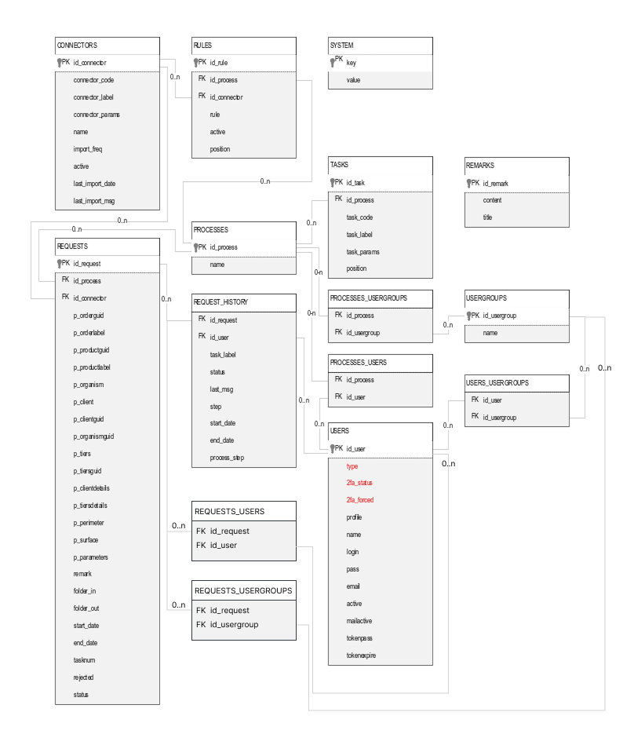
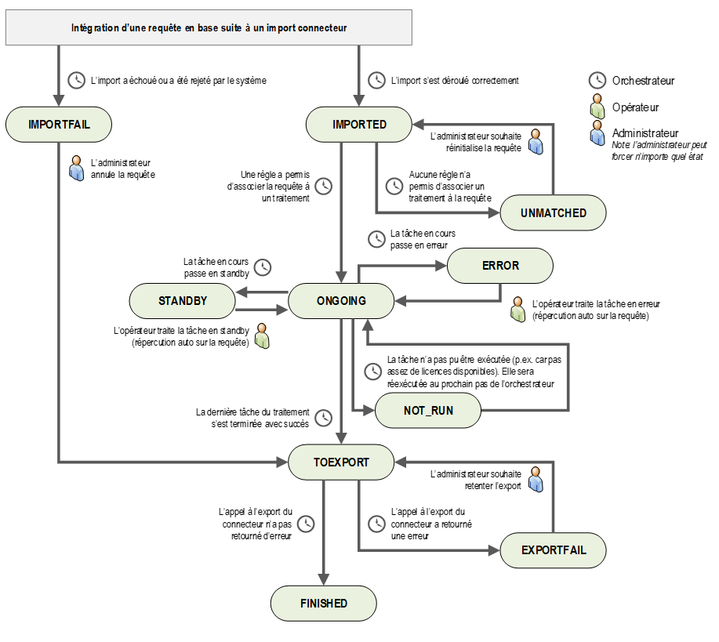

## Development

### Packaging

To generate a WAR of the application, run the following command:

``` bash
mvn package
```

In addition to the WAR file, the delivery archive of a new version
contains:

-   The latest version of the database update script
    (`sql/update_db.sql`)
-   The FME sample script (`fme/`)

### Tests

Unit tests can be run independently of packaging with the command:

``` bash
mvn -q test -Punit-tests --batch-mode --fail-at-end
```

To run integration tests:

``` bash
mvn -q verify -Pintegration-tests --batch-mode
```

For functional tests (requires the application to be running on
localhost port 8080):

``` bash
mvn -q verify -Pfunctional-tests --batch-mode
```


## Application architecture

### Foreword

This document is the technical architecture file for the Extract project. It contains the structural elements of the project, such as the general architecture, data flows, interfaces, and data model. It is primarily intended for:

* The IT project manager
* The project architects
* The production team
* The maintenance team*

### General architecture

#### Basic logic diagram

The following logical diagram illustrates the principle of a configurable process.

{width="1000"}

1. The import is performed by the application for each declared and active connector.
2. For each request element, the application applies the dispatch rules that define which process should be launched.
3. Within each process, the pre-configured tasks are executed. Each process runs independently. The tasks in a process may include the following: adding a comment, validation, extraction, archiving.
4. The export is performed for each request element by the connector that imported it.

#### Software architecture diagram

The proposed solution is based on a modular and scalable architecture. The various functional components are illustrated in the diagram below.

{width="800"}

#### Flows description

The solution consists of a single server, so no specific flow needs to be set up other than HTTP(S) access to this server (port 80 or 443).

### Data description

#### Database schema

A single database and a single schema are created, and the user who owns the schema is used for all connections from the implemented solution (read/write).

#### Conceptual data model

{width="1000"}

#### Data tables description

##### CONNECTORS

Table listing the connectors configured in the system. It is not possible to modify/delete a connector if a related request is incomplete. Deleting a connector involves deleting the associated rules and setting the id_connector of the related requests in the REQUESTS table to null.

| Attribute | Type | Description | Example |
| --- | --- | --- | --- | 
| ``id_connector`` | int | **Primary key** | *1*
| ``connector_code`` | varchar 50 | Code identifying the connector type. Retrieved from the connector itself via a specific function. The code must be unique in the connector catalog. | *easysdiv4*
| ``connector_label`` | varchar 255 | Connector label. Retrieved from the connector itself via a specific function. | *EasySdi V4*
| ``connector_params`` | varchar 4000 | Connector-specific parameters in JSON format. The list of parameters and their types are retrieved from the connector itself via a specific function. | *cf 4.1*
| ``name`` | varchar 50 | Name given to the connector instance | *asitvd_dev*
| ``import_freq`` | int | Frequency of connector queries when active | *60*
| ``active`` | boolean | Defines whether the connector is active or not | *true*
| ``last_import_msg`` |varchar 4000 | Last message returned by the connector import | *Success*
| ``last_import_date`` | datetime | Date and time of the last import | *16/11/2016 21:15*

##### RULES

Table listing the rules applied to a given connector and associating a process with each of them.

| Attribute | Type | Description | Example |
| --- | --- | --- | --- | 
| ``id_rule`` | int | **Primary key** | *1*
| ``id_process`` | int | **Foreign key** linking to the PROCESSES table | *1*
| ``id_connector`` | int | **Foreign key** linking to the CONNECTORS table | *1*
| ``rule`` | varchar 4000 | Definition of the rule according to the system's specific syntax | *prod_code == ‘11’*
| ``active`` | boolean | Defines whether the rule is active or not | *true*
| ``position`` | int | Scheduling of rules for the same connector | *5*

##### PROCESSES

Table listing the processes configured in the system. It is not possible to modify (i.e., the tasks that comprise it) a process if a related request is ONGOING. It is not possible to delete a process if a related request is incomplete or if it is associated with a connector rule.

| Attribute | Type | Description | Example |
| --- | --- | --- | --- | 
| ``id_process`` | int | **Primary key** | *1*
| ``name`` | varchar 255 | Process title | *Réseau de Gaz*

##### TASKS

Table listing the tasks (plugins) configured for a given process.

| Attribute | Type | Description | Example |
| --- | --- | --- | --- | 
| ``id_task`` | int | **Primary key**| *1*
| ``id_process`` | int | **Foreign key** linking to the PROCESSES table | *1*
| ``task_code`` | varchar 50 | Code identifying the task plugin type. Retrieved from the plugin itself via a specific function. The code must be unique in the connector catalog | *FME2016*
| ``task_label`` | varchar 255 | Task plugin label. Retrieved from the plugin itself via a specific function | *Extraction FME 2016*
| ``task_params`` | varchar 4000 | Parameters specific to the task plugin in json format. The list of parameters and their type are retrieved from the plugin itself via a specific function | *cf 0*
| ``position`` | int | Scheduling of tasks between each other for the same process | *3*

##### PROCESSES_USERS

Table ensuring the assignment of one or more users to a given process.

| Attribute | Type | Description | Example |
| --- | --- | --- | --- | 
| ``id_process`` | int | **Foreign key** linking to the PROCESSES table | *1*
| ``id_user`` | int | **Foreign key** linking to the USERS table | *1*

##### PROCESSES_USERGROUPS

Table ensuring the assignment of one or more groups to a given process.

| Attribute | Type | Description | Example |
| --- | --- | --- | --- | 
| ``id_process`` | int | **Foreign key** linking to the PROCESSES table | *1*
| ``id_usergroup`` | int | **Foreign key** linking to the USERGROUPS table | *1*

##### USERS

User table. It is not possible to delete a user if they are associated with a process. When a user is deleted, the items linked to them in the REQUEST_HISTORY table are assigned an ``id_user`` value of ``null``, indicating that the user is now unknown.

| Attribute | Type | Description | Example |
| --- | --- | --- | --- | 
| ``id_user`` | int | **Primary key** | *1*
| ``user_type`` | string | User type: LOCAL: user whose Extract database is the authentication source. LDAP: user whose LDAP server is the authentication source | *LOCAL*
| ``two_factor_status`` | string | 2FA status: ACTIVE / INACTIVE / STANDBY | *ACTIVE*
| ``two_factor_forced`` | varchar 100 | 2FA imposed by the administrator ? | *true*
| ``two_factor_token`` | varchar 100 | String used to generate two-factor authentication codes (encrypted) | *Xxxxx*
| ``two_factor_standby_token`` | string | String used to generate two-factor authentication codes (encrypted) awaiting validation by the user | *Xxxxx*
| ``profile`` | string | Attribute that can take two values. ADMIN: Administrator. OPERATOR: Operator. Note: the texts corresponding to the values are managed in the application itself to ensure multilingual support. | *ADMIN*
| ``name`` | varchar 50 | Full name of the user | *Xxxx*
| ``login`` | varchar 50 | User login | *Xxxx*
| ``pass`` | varchar 60 | User password | *******
| ``email`` | varchar 50 | User email | *example@myentreprise.ch*
| ``active`` | boolean | Defines whether the user is active or not | *true*
| ``mailactive`` | boolean | Defines whether notifications are active for the user | *true*
| ``tokenpass`` | varchar 50 | Token used for password recovery (single use). Attribute reset to null when the user next logs in (regardless of the password used) | *so37dd9sxwxdx3449ckl*
| ``tokenexpire`` | datetime | **Foreign key** linking to the USERGROUPS table. Token expiration date/time | *2016.01.01 12 :00*

##### RECOVERY_CODES

Table of recovery codes per user in case of loss of access to the device enabling two-factor authentication. When a code is successfully used, it is removed from this table.

| Attribute | Type | Description | Example |
| --- | --- | --- | --- | 
| ``id_code`` | int | **Primary key** | *1*
| ``Id_user`` | int | **Foreign key** linking to the USERS table | *1*
| ``token`` | varchar 100 | Recovery code (hashed) | *Xxxxx*

##### REMEMBER_ME_TOKENS

Table tracking tokens issued so that two-factor authentication is not required for a user on a machine for a certain period of time.

| Attribute | Type | Description | Example |
| --- | --- | --- | --- | 
| ``id_code`` | int | **Primary key** | *1*
| ``Id_user`` | int | **Foreign key** linking to the USERS table | *1*
| ``token`` | varchar 100 | Random string contained in the authorization cookie | *Xxxxxx*
| ``tokenexpire`` | timestamp | Date and time of authorization expiration | *154564566*

##### REQUESTS

Table listing current and completed requests.

In order to manage connectors with multiple interfaces, the connector itself must provide the request elements in a standardized format for database entry. This format consists of **p_xxx** attributes.

| Attribute | Type | Description | Example |
| --- | --- | --- | --- | 
| ``id_request`` | int | **Primary key** | *1*
| ``id_process`` | int | **Foreign key** linking to the PROCESSES table.<br> This parameter remains null if no rule matches the query element. | *1*
| ``id_connector`` | int | **Foreign key** linking to the CONNECTORS table. <br> This parameter is null if the associated connector has been deleted | *1*
| ``p_orderlabel`` | varchar 255 | Standardized query parameter <br> Order name| *123456 / 6*
| ``p_orderguid`` | varchar 255 | Standardized query parameter <br> Order ID, also to be provided when sending the result | *677587e2-057f-0144-ddc1-9feca766448f*
| ``p_productguid`` | varchar 255 | Standardized query parameter <br> ID of the product ordered, also to be provided when sending the result | *708e932b-81c3-2ce4-b907-ed07e61ac5f9*
| ``p_productlabel`` | varchar 255 | Standardized query parameter <br> Name of the product ordered | *Plan du réseau d’eau commune de Bex*
| ``p_organism`` | varchar 255 | Standardized query parameter <br> Organization receiving the order | *Terrassements SA*
| ``p_client`` | varchar 255 | Standardized query parameter <br> Customer receiving the order | *Terrassements SA*
| ``p_clientguid`` | varchar 255 | Standardized query parameter <br> Customer ID | *708e932b-81c3-2ce4-b907-ed07e61ac5f9*
| ``p_organismguid`` | varchar 255 | Standardized query parameter <br> Organization ID | *708e932b-81c3-2ce4-b907-ed07e61ac5f9*
| ``p_tiers`` | varchar 255 | Standardized query parameter <br> Third party linked to the order | *Commune de Bex*
| ``p_tiersguid`` | varchar 255 | Standardized query parameter <br> GUID of the third party linked to the order | *708e932b-81c3-2ce4-b907-ed07e61ac5f9*
| ``p_clientdetails`` | varchar 4000 | Standardized query parameter <br> Details of the customer receiving the order | *Nom de rue 37<br>1880 Bex<br>Tel :00.00.00.00.00<br>Mail : xxx@yyy.com*
| ``p_tiersdetails`` | varchar 4000 | Standardized query parameter <br> Details of the third party linked to the order | *Nom de rue 37<br>1880 Bex<br>Tel :00.00.00.00.00<br>Mail : xxx@yyy.com*
| ``p_perimeter`` | varchar 4000 | Standardized query parameter <br> Coordinates of the extraction polygon | *POLYGON((6.9378 46.1056,6.1245 …*
| ``p_surface`` | float | Standardized query parameter <br> Extraction polygon area | *123.4 (m2)*
| ``p_parameters`` | varchar 4000 | Standardized query parameter <br> List of non-standardized parameters passed as is to task plugins | *{‘format’ :’pdf’, … }*
| ``p_external_url`` | varchar 255 | URL for accessing order details on the origin server | *https://viageo.ch/commandes/123456*
| ``remark`` | varchar 4000 | Any comments related to the query element. Modifiable by task plugins | *Donnée fournie à titre confidentielle*
| ``folder_in`` | varchar 255 | Request element input directory. Defined by the application based on a base path (configurable by the administrator). It is sent to task plugins along with the other parameters of the request element | */677587e2-057f-0144-ddc1-9feca766448f/20161212180000/in*
| ``folder_out`` | varchar 255 | Output directory of the request element. Defined by the application based on a base path (configurable by the administrator). It is sent to the task plugins along with the other request element parameters. | */677587e2-057f-0144-ddc1-9feca766448f/20161212180000/out*
| ``start_date`` | datetime | Date and time the query was created in the system. | *22.11.2016 09:00*
| ``end_date`` | datetime | Date and time the query processing ended. | *22.11.2016 09:15*
| ``tasknum`` | int | Number of the task currently in progress in the process. | 
| ``rejected`` | boolean | False by default. <br> Flag indicating that the operator or administrator wanted to stop the associated processing and thus reject the request. | *False*
| ``status`` | string | Status of the request in its lifecycle.<br><br>IMPORTED: Imported – The request is initialized in the system following a connector import (or when the status is forced by the administrator)<br>IMPORTFAIL: Import failure – The request cannot be processed because its import via the connector failed<br>ONGOING: In progress – A rule has allowed the request to be associated with a process. The orchestrator can move it forward.<br>STANDBY: On hold – Manual action is required on the current task (e.g., validation plugin).<br>ERROR: Error – The current task has encountered an error (e.g., FME script not found).<br>UNMATCHED: Unmatched – No rule has allowed a process to be associated with the request<br>TOEXPORT: To be exported – The last task in a process has been completed successfully. The request is ready for export<br>EXPORTFAIL: Export failure – The request has been processed but its export via its original connector has failed<br>FINISHED: Finished – The request has been processed and the export was successful<br><br>Note: the texts corresponding to the values are managed in the application itself in order to ensure multilingual support. | *IMPORTED*
| ``last_reminder`` | datetime | Date and time of the last reminder in the case of a request awaiting validation | *22.11.2016 09:00*

##### REQUEST_HISTORY

Table listing the processing history for each of the requests initiated. For a given request, there may be more items in this table than tasks, since the user can go back in the processing. This table must remain completely independent of the process (and therefore the tasks) attached to the request. This is to avoid corrupting the history if the process is modified retrospectively. All history items must therefore be duplicated in this table (e.g., task_label).

| Attribute | Type | Description | Example |
| --- | --- | --- | --- | 
| ``Id_record`` | int | **Primary key** | *1*
| ``id_request`` | int | **Foreign key** linking to the PROCESSES table| *1*
| ``id_user`` | int | **Foreign key** linking to the USERS table. <br><br>0 = system<br>null = unknown (user deleted)<br><br>Note: the texts corresponding to the values are managed in the application itself in order to ensure multilingual support. | *1*
| ``task_label`` | varchar 255 | Label of the corresponding task plugin or Export for the export step or Import for the import step | *Extraction FME 2016*
| ``status`` | string | Task status <br><br>ONGOING: In progress - The task is being processed<br>STANDBY: Waiting - Manual action is required (e.g. validation plugin)<br>ERROR: Error - The task has encountered an error (e.g. FME script not found) or the import/export has failed<br>FINISHED: Finished - The task/import/export has been successfully completed<br><br>Note: the texts corresponding to the values are managed in the application itself in order to ensure multilingual support. | *FINISHED*
| ``last_msg`` | varchar 4000 | Last message returned by the plugin (error message or success message) or by the connector (import/export step). Incremented by 1 with each new entry in this table (for the same id_request) |
| ``step`` | int | Standardized query parameter <br> Name of the product ordered | *3*
| ``start_date`` | datetime | Date and time when task processing began | *22.11.2016 09:00*
| ``end_date`` | datetime | Date and time when task processing ended<br>Null if the task plugin is currently running. | *22.11.2016 09:02*
| ``process_step`` | int | Task number in the process | *1*

##### SYSTEM

Table listing the system parameters required for the solution to function properly.

| Attribute | Type | Description | Example |
| --- | --- | --- | --- | 
| ``key`` | varchar 50 | **Primary key** | *smtp_port*
| ``value`` | varchar 65000 | System attribute value | *25*

Below is a list of the keys contained in this table. These keys cannot be modified.

| Key | Value (example or domains) |
| --- | --- |
| ``freq_scheduler_sec`` | *1* |
| ``dashboard_interval`` | *10* |
| ``smtp_server`` | *mail.laboite.ch* |
| ``smtp_port`` | *25* |
| ``smtp_from_name`` | *EX3K* |
| ``smtp_from_mail`` | *ex3k.noreply@laboite.ch* |
| ``smtp_pass`` | ****** |
| ``smtp_user`` | *admin* |
| ``smtp_ssl`` | *0* |
| ``base_path`` | *D:\extract\orders* |
| ``display_temp_folder`` | *false* |
| ``mails_enable`` | *true* |
| ``op_mode`` | *ON / RANGES / OFF* |
| ``op_timeranges`` | *[<br>&emsp;{dayfrom :1, dayto :4, timefrom :7, timeto :18},<br>&emsp;{dayfrom :5, dayto :5, timefrom :7, timeto :16},<br>&emsp;{…}<br>]* |
| ``ldap_on`` | *true* |
| ``ldap_servers`` | *ldap.example.com, ldap2.example.com* |
| ``ldap_encryption_type`` | *LDAPS / STARTTLS* |
| ``ldap_base_dn`` | *cn=admin,dc=example,dc=com * |
| ``ldap_admins_group`` | *CN=YourGroup, OU=Users,DC=YourDomain,DC=COM* |
| ``ldap_operators_group`` | *CN=YourGroup, OU=Users,DC=YourDomain,DC=COM* |
| ``ldap_synchro_on`` | *true* |
| ``ldap_user`` | *Service_account_extract* |
| ``ldap_password`` | *xxxxx* |
| ``ldap_synchro_freq`` | *24* |
| ``ldap_last_synchro`` | *22.11.2016 09:00* |
| ``standby_reminder_days`` | *3* |
| ``validation_focus_properties`` | *REMARK, PROJECTION, FORMAT* |

##### REMARKS

Table listing predefined messages to be used as comments during the validation stage of a process.

| Attribute | Type | Description | Example |
| --- | --- | --- | --- | 
| ``Id_remark`` | int | **Primary key** | *1*
| ``content`` | varchar 65000 | Comment text | *Madame, Monsieur, Votre commande...*
| ``title`` | varchar 255 | Comment title (for display in the list) | *Périmètre non valide*

##### USERGROUPS

Table listing user groups that can be assigned to a process

| Attribute | Type | Description | Example |
| --- | --- | --- | --- | 
| ``Id_usergroup`` | int | **Primary key** | *1*
| ``name`` | varchar  50 | User group name | *Responsables cadastre*

##### USERS_USERGROUPS

Table ensuring that users belong to user groups

| Attribute | Type | Description | Example |
| --- | --- | --- | --- | 
| ``Id_usergroup`` | int | Foreign key linking to the USERGROUPS table | *1*
| ``Id_user`` | int | Foreign key linking to the USERS table | *1*

#### Deletion of database elements

The table below shows the constraints and triggers established directly in the database for managing cascading deletions.

Note: these actions/deletions do not need to be managed in the web interface.

| Source element | Target element | Deletion/cascading action |
| --- | --- | --- |
| ``CONNECTORS`` | ``RULES`` | Deleting items in the RULES linked table<br>Note: however, this scenario is only possible for connectors without unfinished linked requests. The interface must not allow a connector to be deleted if it has an ongoing or pending request associated with it. |
| ``CONNECTORS`` | ``REQUESTS`` | Setting the id_connector in the REQUESTS table to null<br>Note: however, this scenario is only possible for connectors without unfinished linked requests. The interface must not allow a connector to be deleted if it has a request in progress or pending. |
| ``REQUESTS`` | ``REQUEST_HISTORY`` | Deleting items in the linked REQUEST_HISTORY table.  |
| ``PROCESSES`` | ``REQUESTS`` | Setting the id_process in the REQUESTS table to null<br>Note: however, this scenario is only possible for completed requests. The interface must not allow a process to be deleted if it has a pending or ongoing request associated with it. |
| ``PROCESSES`` | ``RULES`` | Delete items in the linked RULES table<br>Note: however, this scenario should never occur, as the interface must not allow a process to be deleted if it has a rule associated with it |
| ``PROCESSES`` | ``TASKS`` | Deleting items in the TASKS related table |
| ``PROCESSES`` | ``PROCESSES_USERS`` | Deleting items in the PROCESSES_USERS related table |
| ``PROCESSES`` | ``PROCESSES_USERGROUPS`` | Deleting items in the PROCESSES_USERGROUPS related table |
| ``USERS`` | ``REQUEST_HISTORY`` | Setting the id_user in the REQUEST_HISTORY table to null |
| ``USERS`` | ``PROCESSES_USERS`` | Deleting items in the PROCESSES_USERS related table |
| ``USERS`` | ``USER_USERGROUPS`` | Deleting items in the USER_USERGROUPS related table |
| ``USERS`` | ``RECOVERY_CODES`` | Delete items in the RECOVERY_CODES related table |
| ``USERS`` | ``REMEMBER_ME_TOKENS`` | Delete items in the REMEMBER_ME_TOKENS related table |
| ``USERGROUPS`` | ``PROCESSES_USERGROUPS`` | Delete items in the PROCESSES_USERGROUPS related table |
| ``USERGROUPS`` | ``USER_USERGROUPS`` | Delete items in the USER_USERGROUPS related table |

#### Request lifecycle

Requests follow the lifecycle illustrated in the diagram below. Transitions show the system or user event that triggered them.

{width="900"}

### Description of interfaces and third-party systems

#### Connector catalog

##### Introduction

The connector catalog contains all connectors available for the system. They must all implement the following interface functions:

* ``String getCode``: returns the connector code, which must be unique in the catalog
* ``String getLabel``: returns the connector name
* ``String getDescription``: returns formatted text describing the connector
* ``String getHelp``: returns formatted text to guide the user in entering parameters
* ``String getParams``: returns the parameters specific to the connector, in json format. Each parameter is defined by a unique code, a label, a type, whether it is mandatory or not, and any other tags specific to the type. The types available for connectors are as follows:
    * **text** : character string to be entered via a text box. The maximum length of the string is specified in an additional attribute.
    * **pass**: character string to be entered via a hidden text field. The maximum length of the string is specified in an additional attribute.
* ``Object new(params)``: creates an instance of the connector by passing the user-defined parameters. Returns the created object.
* ``Object importCommands()``: launches the command import. Returns an object consisting of an error code, the list of request elements in standardized format, and, if applicable, an associated message.
* ``Object exportResults(request)``: launches the export of a command result. The request element (containing in particular the output directory, the remark attribute, the status, etc.) is passed as a parameter (complete object from the REQUESTS table). Returns an error code and, if applicable, an associated message.

The following chapters list the return values of these functions for each of the connectors available in the first version of the solution. Note that plugins must implement multilingual support in the return values of functions. The descriptions below correspond to the English version.

##### Easy SDI v4 connector

| Function | Return |
| --- | --- |
| ``getCode`` | easysdiv4 |
| ``getLabel`` | EasySdi V4 |
| ``getDescription`` | *Connecteur pour la solution EasySdi V4* |
| ``getHelp`` | *Se référer directement au connecteur* |
| ``getParams`` | [<br>&emsp;{‘code’ : ‘url’, ‘label’ : ‘URL du service’, ‘type’ : ‘text’, ‘req’ : ‘true’, ‘maxlength’ : 255},<br>&emsp;{‘code’ : ‘login’, ‘label’ : ‘Login distant’, ‘type’ : ‘text’, ‘req’ : ‘true’, ‘maxlength’ : 50},<br>&emsp;{‘code’ : ‘pass’, ‘label’ : ‘Mot de passe’, ‘type’ : ‘pass’, ‘req’ : ‘true’, ‘maxlength’ : 50}<br>]<br><br>Below is an example of the corresponding settings (connector_params attribute in the CONNECTOR table):<br><br>{<br>&emsp; ‘url’ : ‘http://www.asitvd.ch/extractpoint/rest’,<br>&emsp; ‘login’ : ‘fournisseur12445’,<br>&emsp; ‘pass’ : ‘motdepasse’<br>}|

#### Task Plugin Catalog

##### Introduction

The task catalog contains all of the task plugins available for the system. They must all implement the following interface functions:

* ``String getCode``: returns the plugin code, which must be unique in the catalog.
* ``String getLabel``: returns the task plugin name.
* ``String getDescription``: returns formatted text describing the plugin 
* ``String getHelp``: returns formatted text to guide the user in entering parameters
* ``String getPictoClass``: returns the class to be used for the plugin pictogram
* ``String getParams``: returns the parameters specific to the task plugin, in json format. Each parameter is defined by a unique code, a label, a type, whether it is mandatory or not, and any other tags specific to the type. The types available for task plugins are as follows:
    - **text**: character string to be entered via a text box. The maximum length of the string is specified in an additional attribute. 
    - **multitext**: character string to be entered via a multi-line text box. The maximum length of the string is specified in an additional attribute. Parameters of this type support    dynamic strings using the same keywords as the text type.
    - **pass**: character string to be entered via an obfuscated text field. The maximum length of the string is specified in an additional attribute.
    - **list**: list of choices to be entered via a drop-down list. The available options are specified in an additional attribute (values separated by |)
    - **boolean**: boolean to be entered via a checkbox
    - **email**: email address or list of email addresses separated by a semicolon and/or a comma.
    - **list_msgs** (for new validation plugin): multiple choice list filled in by the Extract core with the validation messages defined at the Extract instance level.
    - **numeric** (for FME Desktop plugin): Numeric value. Min, max, and step are specified in three additional attributes.
* ``Object new(params)``: creates an instance of the plugin by passing the user-defined parameters. Returns the created object.
* ``Object execute(request)``: executes the task plugin according to the request element passed as parameters. Returns an object of the type:
    * **State**: status among success, error, standby
    * **Code**: if applicable, return code 
    * **Message**: message associated with the state (stored in last_msg for info). This can be a raw message from a tool underlying the plugin (e.g. FME), an informative message explaining why the plugin is on standby, etc.
    * **Request**: request element passed as input and possibly modified by the plugin

The following chapters list the return values of these functions for each of the plugins available in the first version of the solution. Note that plugins must implement multilingual support in the return values of functions (except, of course, for error/success messages from underlying tools). The descriptions below correspond to the English version.

##### File Archiving Plugin

| Function | Return |
| --- | --- |
| ``getCode`` | ARCHIVE |
| ``getLabel`` | Archivage fichiers |
| ``getDescription`` | Copie des fichiers dans un répertoire local ou réseau |
| ``getHelp`` | *Se référer directement au connecteur* |
| ``getPictoClass`` | *Se référer directement au connecteur* |
| ``getParams`` | [<br>&emsp;{‘code’ : ‘path’, ‘label’ : ‘Chemin d’archivage’, ‘type’ : ‘text’, ‘req’ : ‘true’, ‘maxlength’ : 255},<br>&emsp;{‘code’ : ‘login’, ‘label’ : ‘Login’, ‘type’ : ‘text’, ‘req’ : ‘false’, ‘maxlength’ : 255},<br>&emsp;{‘code’ : ‘pass’, ‘label’ : ‘Mot de passe’, ‘type’ : ‘pass’, ‘req’ : ‘false’, ‘maxlength’ : 255},<br>]<br><br>Below is an example of the corresponding settings (task_params attribute in the TASK table):<br><br>{<br>&emsp; ‘path’ : ‘/var/extraction/{no_commande}-{date}/{code-produit}/’<br>}|

Note: This plugin supports dynamic strings in its settings according to the following keywords:

* {orderLabel}
* {orderGuid}
* {productGuid}
* {productLabel}
* {startDate}
* {organism}
* {client}

