## Login

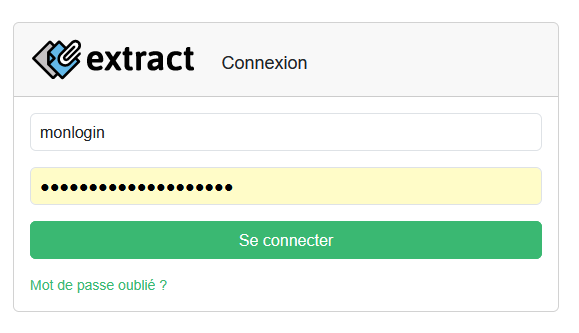{width="500"}

Access to the application is secured and requires authentication via either:

* A user account created by the administrator (see [User Administration](./admin-guide.md/#user-administration)), or
+ An account linked to the corporate LDAP directory (see [LDAP-Based User Authentication](./admin-guide.md/#ldap-based-user-authentication)).

Usernames are **not** case-sensitive, but passwords **are** case-sensitive.

## Reset password

If you've forgotten your password, click the ``Mot de passe oublié ?`` link on the login screen. This will guide you through a two-step password reset process.

!!! Note
    This option is only available for local user accounts. If you're using LDAP authentication, please reset your password through your corporate directory. 

### 1. Request reset code

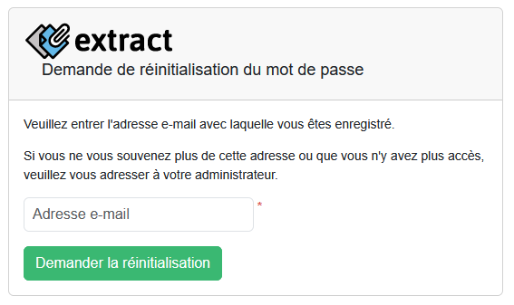{width="500"}

Enter the email address associated with your user profile — the same one used to receive Extract notifications — and click ``Demander la réinitialisation``. A message containing a verification code will be sent to that address. Enter the code on the next page to proceed.

### 2. Reset

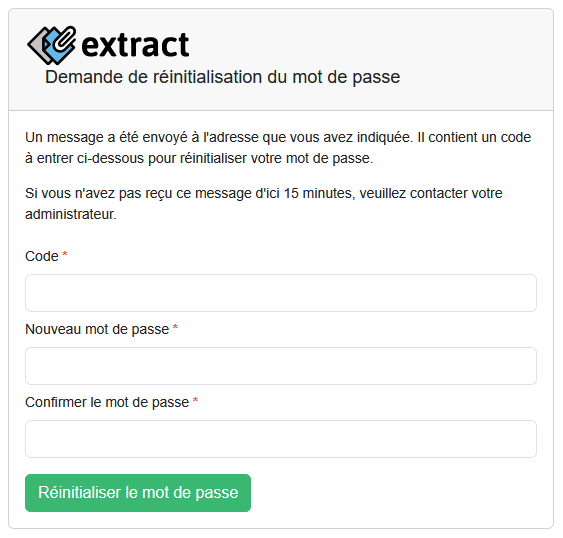{width="500"}

Enter the code received by e-mail, then enter the desired password and confirm. The password must contain at least 8 characters. Then click on ``Réinitialiser le mot de passe``. If successful, you will be redirected to the login page with a message telling you that your password has been reset. You can now log in with your new password.

**Reset code validity**

The reset code remains valid only under the following conditions:

* **Same session usage:** The code must be used within the same browser session in which it was requested. Do not close or refresh the browser window after requesting the code.
* **No login with old password:** If you log in using your current (old) password after requesting the reset code, the code becomes invalid.
* **Time limit:** The code will expire automatically if not used within 20 minutes of being issued.

If you're unable to reset your password or don't remember the email address associated with your account, please contact your administrator for assistance.

## Two-factor authentication

{width="500"}

Once 2FA is successfully activated and set up, users will be prompted to enter the verification code from their Google Authenticator app after logging in with their password. When checking the option ``Faire confiance à cet appreil pendant 30 jours`` the 2FA code is no longer asked on the current device for 30 days. However, this does not enable automatic login, username and password will still be required.

**Recovery code**

If a user has lost access to Google Authenticator or accidentally deleted the associated Extract account entry, they can still access the application by clicking on the ``Utiliser un code de récupération`` link. They will then need to enter one of the recovery codes provided during the initial setup (see [Two-Factor Authentication Setup](#two-factor-authentication-setup)).

Important:

* Each recovery code can only be used once.
* After logging in, it is recommended to reset two-factor authentication via the user administration section.

## Current user administration
{width="150"}

On the right side of the menu bar, you’ll find options related to the currently logged-in user.

By clicking on the user’s name, the following settings can be managed:

**For all users:**

* Enable or disable two-factor authentication
* Choose whether to receive email notifications

**For local (non-LDAP) users only:**

* Update full name
* Change username/login (must be unique within the application)
* Change email address (must be unique within the application)
* Change password

Additionally, all users can log out by clicking the logout icon.

### Two-Factor Authentication Setup

When the user selects the drop-down button at the top of the page to enable or reset two-factor authentication, they are redirected to a registration page :

{width="500"}

1. **Scan the QR Code**

    Use Google Authenticator or any compatible app to scan the QR code displayed on screen. Alternatively, you can enter the code manually into the app.

2. **Enter the Verification Code**

    Once the code is generated by your app, enter it in the field provided and click ``Continuer``.
    If the code is correct, two-factor authentication (2FA) will be successfully enabled for your account.

3. **Save Recovery Codes**
    
    A screen will then display single-use recovery codes. These can be used to access Extract in case you lose access to Google Authenticator.

    * You can download or print these codes.
    * **Important**: These codes will not be shown again, so store them in a secure location.
    * **Warning**: Recovery codes allow access to your account without the second factor. Treat them as confidential.

If two-factor authentication is not mandatory for this user, you may choose to cancel the registration process. In this case, the account's 2FA status will remain unchanged:

* If 2FA was previously disabled, it stays disabled.
* If it was already enabled, it remains active with the previously configured setup.

## Requests list

The home page provides a real-time overview of the application's activity, including:

* Status of active connectors
* Requests in progress
* History of completed requests

**Administrators** can view all requests. **Regular users** only see requests associated with processes where they are assigned as operators.

The page updates automatically based on the refresh interval defined in the application settings (see [Orchestration Section](./admin-guide.md/#orchestration)). By default, this interval is set to 20 seconds.

### Status of active connectors

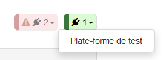{width="250"}

In the top-right corner of the page, chips show active connectors grouped by their current state:

* Flashing red chip: Indicates connectors that have encountered errors and exceeded the maximum number of retry attempts.
* Green chip: Represents connectors whose last import request was successful (regardless of whether request was imported or not), or those still within the allowed retry limit after an error.

If no connectors fall under a particular status, the corresponding chip is not shown. For operators, only error messages may be visible.

Clicking on a chip opens a dropdown listing the relevant connectors. Hovering over a connector displays a tooltip with the time of the last import and any associated error message. Administrators can click a connector to view and edit its settings (see [Connectors detail](./admin-guide.md/#connectors-detail)).

### Requests in progress

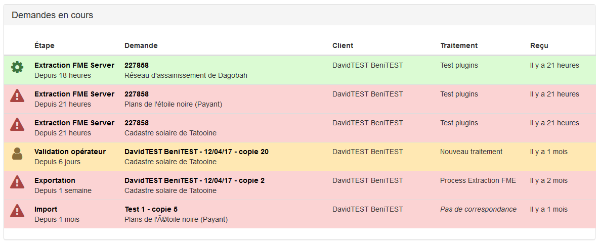{width="1000"}

The first table contains requests that have been imported but not yet processed. The background color of the line indicates the status:

* Green : Processing is running at expected
* Orange : Processing is paused pending operator validation
* Red : Processing stopped due to an error

Clicking anywhere on a row opens the request details (refer to [Request details](#request-details)). To open the request in a new tab or window, click directly on the request number.

### Completed requests

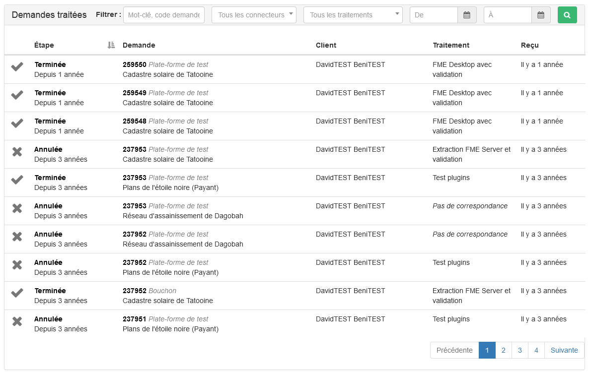{width="1000"}

The second table lists requests that have been exported to their origin server. Due to its potentially large volume, it includes a filtering feature based on the following criteria:

* Text search (partial and case insensitive) in the following fields:
    * Request label
    * Product label
    * Customer name
    * Third party name

* Connector through which the request was imported
* Associated processing
* Request reception date using two date fields to define a range

All search criteria are optional. When multiple criteria are specified, they are combined using the **AND** operator.

The search is executed only when you click the green **search button** (magnifying glass icon). Alternatively, you can start the search by pressing **Enter** while focused on a text or date input field.

## Request details

### Processing status

{width="1000"}

The stages in the processing of the request are displayed at the top of the page, along with their status. The color code is as follows:

| Color      | Status                          |
| ----------- | ------------------------------------ |
| **Light green**       | The task has been successfully completed  |
| **Dark green**       | The task is running |
| **Orange**       | The task awaits validation by an operator |
| **Red**       | An error has occurred while running the task |
| **Grey**       | Task has not yet been executed or has been skipped |

### Actions
If processing is interrupted by an error or a validation request, an action box is displayed so that you can decide how to proceed.

#### Validation

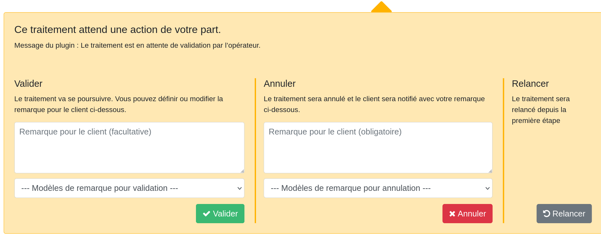{width="1000"}

When a task requires the processing status to be validated by an operator in order to continue, the following actions are available :

* **Validate**: The operator determines that the processing is in the expected state and confirms that processing can continue normally. For this action, entering a comment is optional. If a comment has already been defined at a previous stage of processing, it is displayed in the text box. It is then possible to modify, replace, or even delete it. If at least one comment template has been defined for the validation of this processing, a drop-down list appears below the comment field. If an item from this list is selected, the corresponding text replaces the current validation comment. This text can be modified before validation.

* **Cancel**: The operator determines that the process cannot be successfully completed. The request will then be rejected and exported without result. No other tasks will be performed. In this case, a comment **must** be entered to explain to the customer why their request was rejected. If a comment has already been defined at a previous stage of the process, it will be displayed in the text box. It is then possible to modify, replace, or even delete it. If at least one comment template has been defined for canceling this processing, a drop-down list appears below the comment field. If an item from this list is selected, the corresponding text replaces the current cancellation comment. It is possible to modify this text before canceling.

**Restart**: Deletes all files generated so far for this request and runs the process from the beginning.

#### Task error

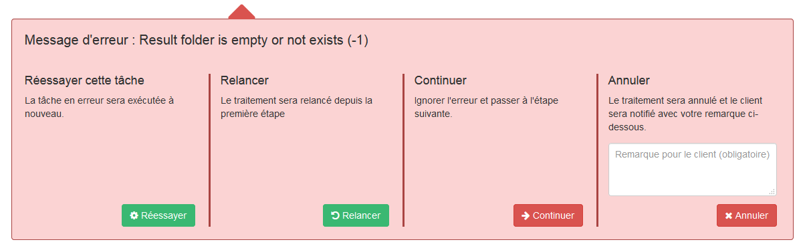{width="1000"}

When the last task ended with an error, the following actions are available.

* **Retry**: Runs the task that caused the error again.
* **Restart**: Deletes all files generated so far for this request and runs the process from the beginning.
* **Continue**: Ignores the current task and continues processing with the next task. If processing is complete, the result of the request is exported.
* **Cancel**: The operator determines that the processing cannot be successfully completed. The request will then be rejected and exported without a result. No other tasks will be executed. A comment must be entered to explain to the customer why their request was rejected.

#### No processing associated

!!! Info 
    Only administrators can view this error status

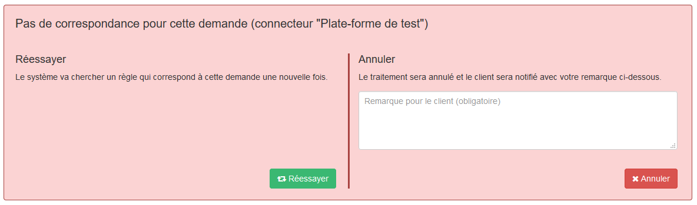{width="1000"}

If the request could not be associated with any processing based on the rules defined for the connector with which it was imported, the following actions are available.

* **Retry**: Restarts the process of associating the request with a process. This function is particularly useful when the connector rules have been modified to handle this specific case.
* **Cancel**: The administrator determines that the request cannot be processed successfully. It will then be rejected and exported without result. A comment must be entered to explain to the customer why their request was rejected.

#### Import error

!!! Info 
    Only administrators can view this error status

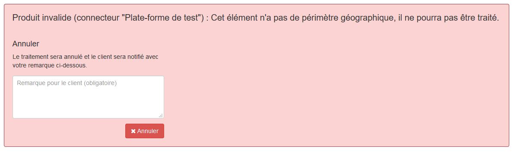{width="1000"}

If an error preventing the request from being processed is detected during import, only one action is possible:

* **Cancel**: The request will be rejected and exported without result. A comment must be entered to explain to the customer why their request was rejected.

#### Export error

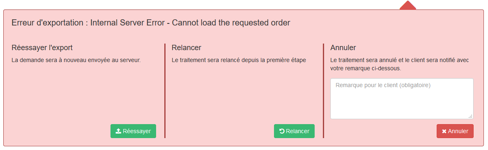{width="1000"}

If the result of the request could not be sent to the original server, following actions are possible:

* **Retry export**: Attempts to send the result of the request again as is. This function is particularly useful in the event of a temporary error, such as server unavailability.
* **Restart**: Deletes all files generated so far for this request and runs the process from the beginning.
* **Cancel**: The administrator determines that the request cannot be processed successfully. It will then be rejected and exported without result. A comment must be entered to explain to the customer why their request was rejected.

### Request information

#### Customer response

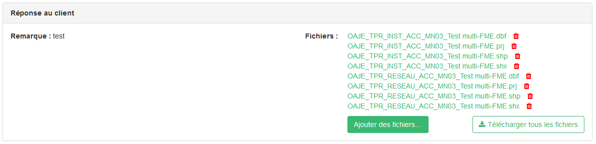{width="1000"}

This section displays the information that will be returned to the customer in the current processing state.

You can download the generated files by clicking on them. If more than one file is available, there is a button that allows you to download them all in a ZIP file.

If the request has an error or is awaiting validation, files can be added to those that will be returned to the user using the ``Ajouter des fichiers`` button. Files can also be deleted by clicking on the red icon next to the file. **Warning**: Once the deletion confirmation has been accepted, this action cannot be undone.

This section may not be displayed if no comments are defined, if the request's output directory does not contain any files, and if the request is not in a state that allows the files in the output directory to be modified.

#### Customer request

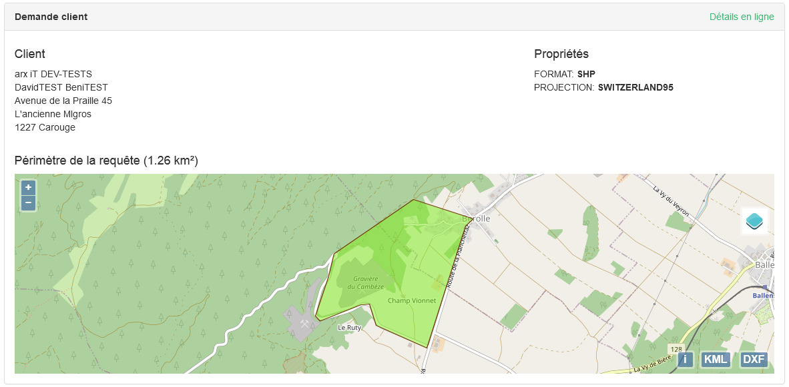{width="1000"}

These are the parameters of the request as submitted by the customer.

If the connector settings ``URL de détail de commande`` is set, a link in the panel header opens the original order details in a new window.

On the map, two buttons allow you to download the order's footprint polygon in KML format (WGS84 coordinates) or DXF format (in the map's coordinate system).

#### Processing history

{width="1000"}

This table tracks all stages of request processing, including any new task executions, processing restarts, or ignored tasks.

#### Administration panel
!!! Info 
    Only administrators can view this error status

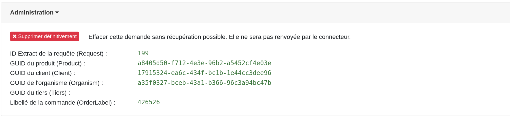{width="1000"}

This panel is collapsed by default and can be expanded by clicking on its title. 

It contains a button that allows you to delete a request. Processing will be immediately interrupted and no results will be returned to the client (not even a rejected request). This tool is intended as a last resort and should not be used during normal operation.

In addition, it contains useful information for resolving potential problems, e.g. with FME scripts.

 
 
 
 
 