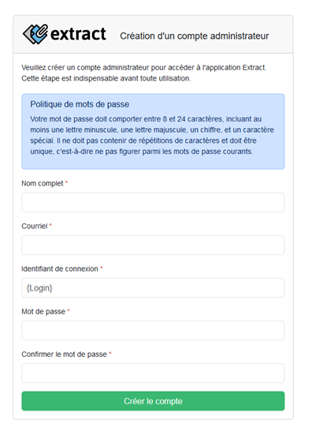

## Software prerequisites

* 64-bit Windows or Linus operating system
* Java 17 (Oracle or OpenJDK full version, not Headless)
* PostgreSQL 13 or above (Extract may work with older versions that are not supported anymore)
* Tomcat 9 (Extract is not currently compatible with Tomcat 10 due to the use of SpringBoot 2)
* A “modern” web browser (<2 years old) to access the application

## Installation

!!! Info 
    In the given paths, **[ZIP]** indicates the root of the delivered ZIP file in the release assets. Otherwise, relative paths are expressed in relation to the directory in which the application is deployed.

!!! Tip
    The latest release can be downloaded [here](https://github.com/asit-asso/extract/releases/tag/v2.2.0).

1.	Create a PostgreSQL database to store the application data. Encoding must be UTF-8.
2.	The database must be accessible by a user with read, write and object creation/deletion privileges. The database content is automatically generated when the application is first started.
3.	Deploy the `[ZIP]\application\extract##x.x.x.war` file to Tomcat server.
It is normal for any automatic start-up of the application after deployment to fail.
4. In the folder of the deployed application, go to the `WEB-INF\classes` directory and modify the ``application.properties`` file.
5. Modify the database connection properties:
    * **spring.datasource.url** : JDBC database connection string
    * **spring.datasource.username** : Database user name
    * **spring.datasource.password** : Database user password

6. (Optional:) If necessary, change the application language using the `extract.i18n.language` property in the `application.properties` file. The value must be the ISO code of the desired language (e.g. `en`). Translation files for this language must exist in a directory of the same name under `WEB-INF\classes\static\lang`. To add a new language, please refer to [Add a new language section](../customize/#add-a-new-language).
7.	Enter the application URL using the `application.external.url` property. The value of this property is used to generate links in notification e-mails.
8.	Enter a random 32-character ISO-8859-1 string for `database.encryption.secret` and `database.encryption.salt` properties. These strings are used as keys to encrypt certain database values.
9.	Save the file.
10.	In the same folder, log properties can be defined in the `logback-spring.xml` file.
11.	Start the application. 
12. Connect to the database. 
13.	Execute the `[ZIP]\sql\update_db.sql` script to apply any database schema modifications that are not automatically performed by the application.
14.	Connect to the application. When logging in for the first time, the user must create an admin account:

    

15.	Fill in the fields and click `Créer le compte`.
16.	Go to `Settings`.
17.	Enter the storage path. This is the directory in which data relating to request processing will be written. The Tomcat user must therefore have read and write rights to this directory.
18.	Enter SMTP server parameters for sending notifications.
19.	Click on ``Enregistrer``.
20.	Congratulation ! The application is now operational.

## Application Update

**If you already have a previous version of the application installed, please follow the procedure below.**

1. Back-up the following files so you don't have to redefine your configuration:
    * ``WEB-INF\classes\application.properties``
    * ``WEB-INF\classes\logback-spring.xml``
    * ``WEB-INF\classes\static\js\requestMap\map.custom.js`` (if you've set it)
    * ``WEB-INF\classes\templates\email\html\*`` (if you've customized the e-mail templates)
    * ``WEB-INF\classes\static\lang\*\message.properties``

2. Undeploy the existing Extract application.
3. For Tomcat on Windows: go to the directory where Tomcat is installed and delete all directories named ``[digit]-extract`` (e.g. ``0-extract``, ``1-extract``,...) under the ``temp`` sub-directory.
4. Deploy the new WAR.
5. Compare the ``WEB-INF\classes\application.properties`` file with the one you backed-up, and transfer any new or modified properties to the latter.
> !!! Info "Updating to version 2.1"
    Enter a random 32-character ISO-8859-1 string for `database.encryption.secret` and `database.encryption.salt` properties. These strings are used as keys to encrypt certain database values.

6. Overwrite the folowing file with your backup :
    * ``WEB-INF\classes\logback-spring.xml``

7. Copy your backup ``map.custom.js`` file (if set) to the ``WEB-INF\classes\static\js\requestMap`` directory.
> !!! Info "Updating to version 2.1"
    The OpenLayers library used to display the map underwent a major update (to 9.1.0) when Extract was upgraded to version 2.1. The code used to register a projection system has changed (see the new version of the ``map.custom.js`` example file). Depending on the functionality used, further modifications may be necessary. Please refer to the official documentation if necessary: [https://openlayers.org/en/v9.1.0/apidoc/](https://openlayers.org/en/v9.1.0/apidoc/)

8. Compare the e-mail templates in ``WEB-INF\classes\templates\email\html\`` with those you've backed up, to merge any changes you've made with the new version.
9. Compare the language files in ``WEB-INF\classes\static\lang\*\`` with those you've backed up, to merge any changes you've made with the new version.
10. Restart the Tomcat Extract application to take account of the updated configuration files.
11. Connect to the database.
12. Run the ``[ZIP]\sql\update_db.sql`` script to apply any changes to the structure that are not made automatically by the application.

## Server Migration

!!! Info 
    The procedure below details how to proceed if the application needs to be migrated to other servers.

### Actions on the old server

1. Make a backup of the directory containing current processing data. The path of this directory is defined in the application parameters (``Paramètres`` > ``Emplacement des fichiers temporaires``).
2. Make a backup of the configuration and customization files as per **step 1** [in the Application Update section](#application-update).
3. If the database is also being migrated, make a dump of the Extract database.

### Actions on the new server

1. If the database has also been migrated, restore the Extract database dump.
2. Restore backup of current processing data.
3. Follow the [update procedure](#application-update) from **step 4**
4. If the path to the folder containing the current processing data has changed, don't forget to modify it in the application (``Paramètres`` > ``Emplacement des fichiers temporaires``).
 
 
 
 
 