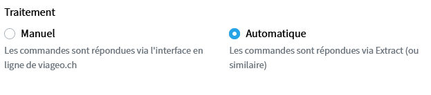
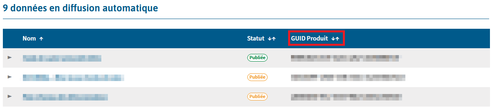

# Connect Extract to viageo.ch
!!! Warning 
    This section is only useful if your organization provides geodata on the platform [viageo.ch](https://viageo.ch){target="_blank"} or [plans-reseaux.ch](https://plans-reseaux.ch){target="_blank"}. You must be an [ASIT](https://asit-asso.ch){target="_blank"} member to distribute geodata through these platforms.

!!! Info 
    If you want to test the connection to a non productive instance of viageo.ch, you can use the validation instance. See [viageo.ch Validation Instance](../misc/viageo-test.md)

This section explains how to connect Extract to the data portal viageo.ch, to read requests from the platform and send back extracted geodata to it. 

## Configure your resources on viageo.ch

1. Log in to your viageo.ch account.
2. Go to your ressources (`Diffuser` tab > `Mes ressources`)
3. For each geodata you want to distribute via Extract, go to edit mode and set the `Traitement` parameter to `Automatique` under the `Commande en ligne` section.

    {width="600"}

## Configure a connector on Extract

1. Log in to your Extract instance with an administrator role
2. Create a new EasySDI v4 connector (see [Admin guide > Connectors](../features/admin-guide.md#connectors))
3. The `URL du service`, `Login distant` and `Mot de passe` parameters can be found on viageo.ch under [`Diffuser` > `Automatiser le processus`](https://viageo.ch/diffuser/extract/){target="_blank"}

    !!! Warning 
        These parameters are only accessible for the main account of your viageo.ch organization.

## Configure a process and link it to viageo resource

1. Usually, you want to create one process by resource from viageo.ch. The process will be in charge of extracting the corresponding geodata. To create a new process see [Processes](../features/admin-guide.md#processes).
2. Once the process is created, create a new connector's rule (see [Connector rules](../features/admin-guide.md#connector-rules)) to connect the process to the corresponding resource from viageo.ch. To do that, the rule syntax is the following:

    ```
    productguid == "viageo resource id" 
    ```

    !!! Info 
        Viageo resources id can be found on viageo.ch under [`Diffuser` > `Automatiser le processus`](https://viageo.ch/diffuser/extract/){target="_blank"} (only accessible for the main account of your organization) in the resources list.
        <br>

        {width="1000"}

        

<br>
<br>
<br>
<br>
<br>