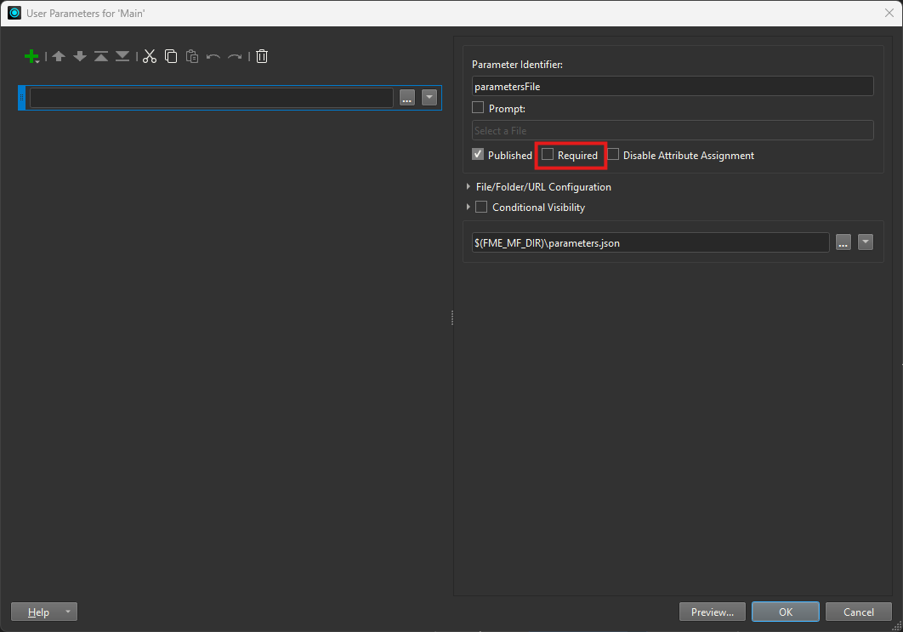
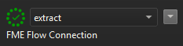
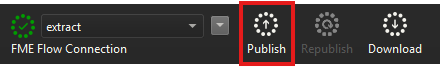
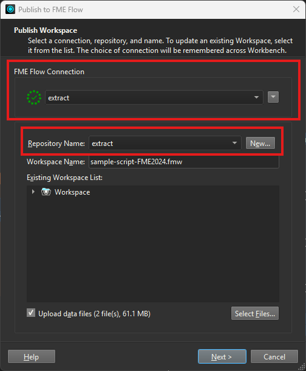
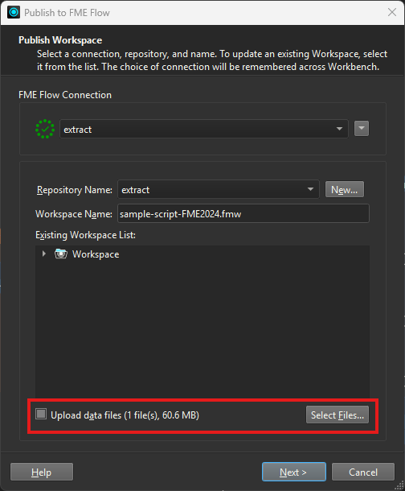
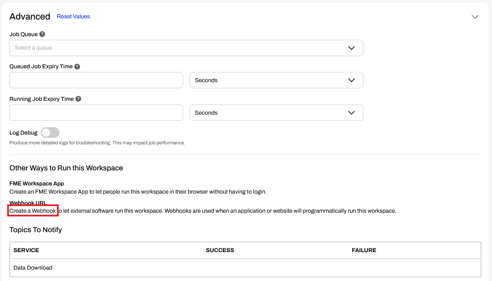
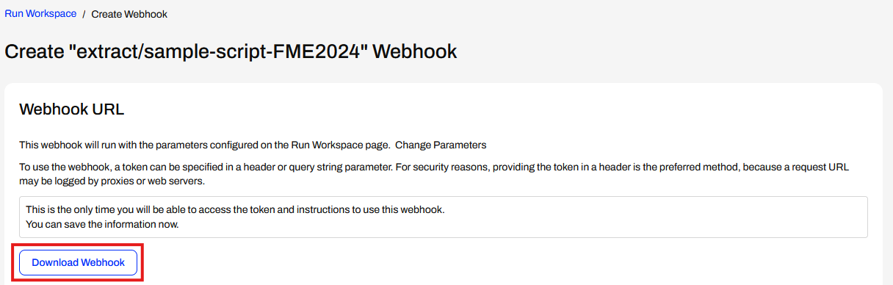
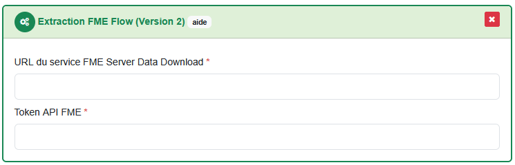

# Set up an extraction using FME Flow (Server)

!!! info

    This tutorial uses the extraction plugin `Extraction FME Flow (Version 2)` which allows unlimited parameters length, thus allowing request with precise geometries like municipalities boundary.

To follow along with this tutorial, download the sample script and data available [here](https://github.com/asit-asso/extraction-samples). Either by cloning the repo :

```
git clone https://github.com/asit-asso/extraction-samples.git
```

Or downloading a ZIP archive with the following link : https://github.com/asit-asso/extraction-samples/archive/refs/heads/main.zip

## Set up the FME workspace inside FME Flow

1. In the downloaded folder, go to the subfolder `fme` and open up the `sample-script-FME2024.fmw` FME workspace. This tutorial uses the same workspace as the previous tutorial for FME Form.

2. First, we need to uncheck the `required` option of the `parametersFile` User Parameter in order to let FME Flow override the `parameters.json`.

    

2. Then, connect to your FME Flow instance.

    

3. Next, publish the workspace to FME Flow

    

    Choose a valid FME Flow connection and create a new repository where to publish the workspace, e.g. `extract` or use an existing one.

    

4. Make sure the `Upload data files` option is checked ans select only the `swissTLMRegio_Buildings_2056.zip` file. Indeed, the latter is our business data to be extracted and must be uploaded to FME Flow. But the `parameters.json` file can be omitted since the parameters will be overridden by the `FME Data Download` body request (see below).

    

5. The `Extraction FME Flow (Version 2)` plugin sends all request parameters encoded as a `GeoJSON` through the body of the `FME Data Download` POST request. To tell FME to use the request's body as GeoJSON input for the `FeatureReader`, we need to do the following : 

    * In the last dialog, select the `Data Download` Service. 
    * Click on the edit button and under `Send HTTP Message Body to Reader`, select the GeoJSON Reader (in our case, this is the `FeatureReader` "Read_Parameters"). 
    * Under `Writers in Download`, select all available writers. Therefore, data outputted in all formats will be available in the Data Download Service response.

        

7. Once we have uploaded the workspace and the necessary data to FME Flow, we need to create an API token to authenticate the request that will be posted by Extract.

    In FME Flow, under Workspaces, go to your extract repository. Select the corresponding workspace (`sample-script-FME2024.fmw` in our example). Under the `Advanced` tab, click on `Create a Webhook`.

    

    In the next dialog, make sure the `User Can Upload` option is checked and click on `Create`.

    In the next dialog, click on `Download Webhook`. This will download a text file with the URL to call the request and the API token to authenticate it. This is the **only** chance you get to retrieve these information !

    

8. In the downloaded text file, write down the URL to call the `FME Data Download Service` without the query parameters and the API token.

    

## Connect the workspace to Extract

1. In Extract, create a new or use an existing process (see [processes](../features/admin-guide.md#processes)).

2. Drag and drop the task plugin `Extraction FME Flow (Version 2)` into the process task list.

3. In the field `URL du service FME Server Data Download`, type the URL of your service. In the field `Token API FME`, type the API token.

    

4. To test the extraction, you can link this process to viageo (see [Connect Extract to viageo.ch](../how-to/extract-viageo.md)). With our example, the linked resource can be orderable over the entire Switzerland in the following format : `shapefile`, `geopackage`, `GeoJSON` and `DXF`. 

5. Finally, you can order the linked product on viageo, Extract will retrieve the request and run the FME workspace by calling the FME Flow Data Download Service with all request parameters carried out in API request's body.

<br>
<br>
<br>
<br>
<br>