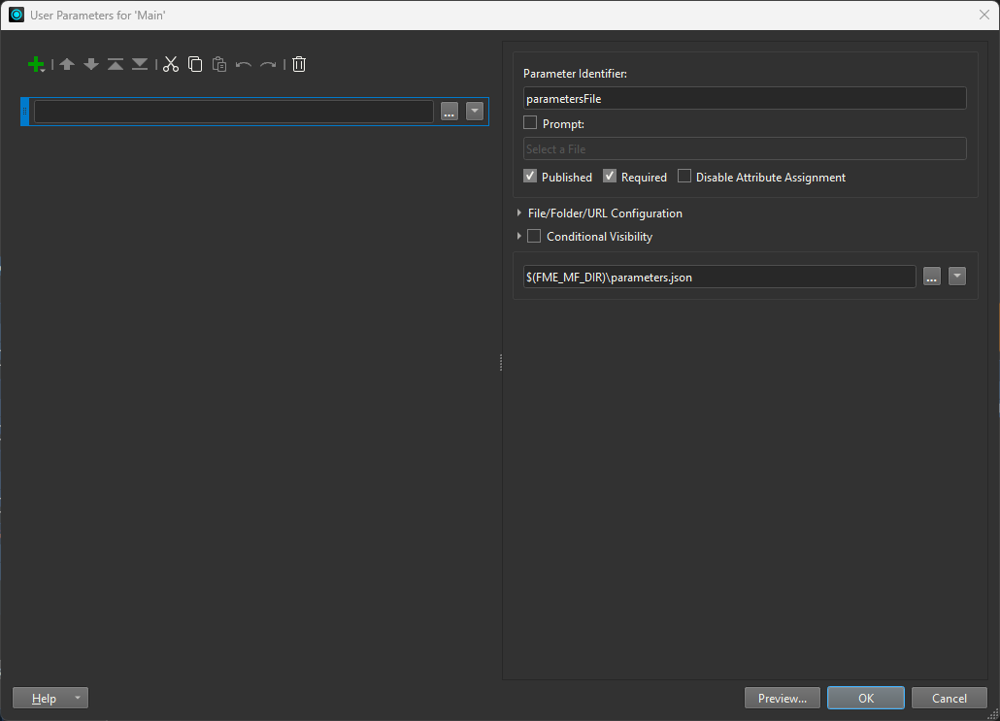
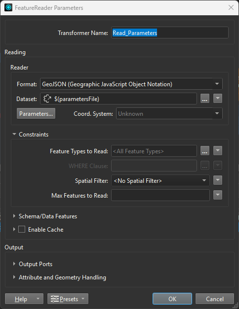
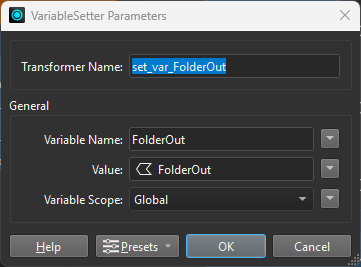
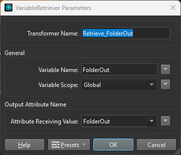
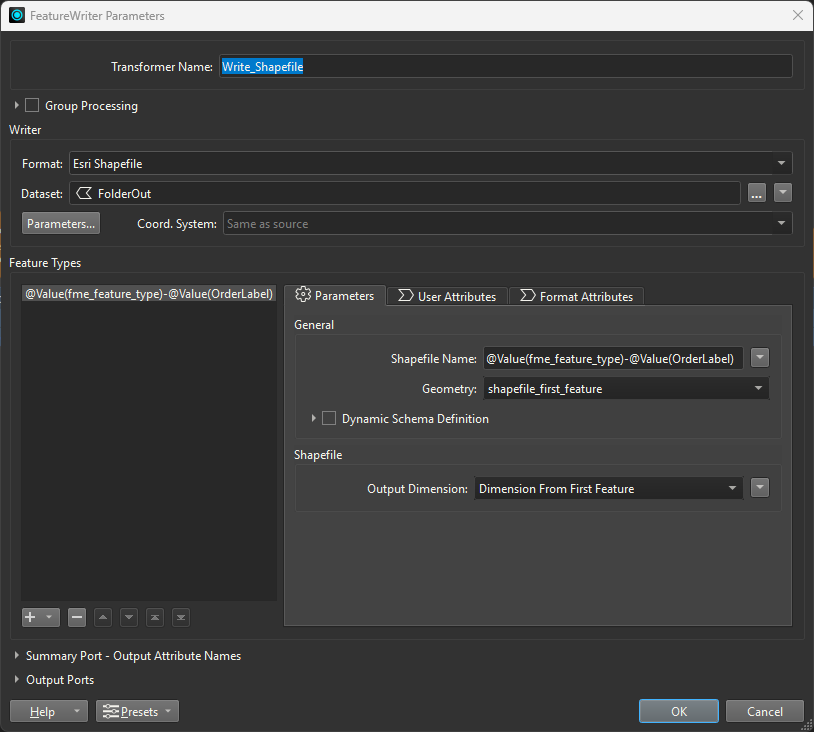
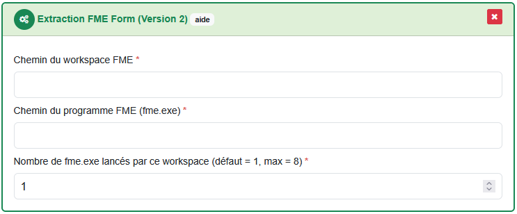

# Set up an extraction using FME Form (desktop)

!!! info

    This tutorial uses the extraction plugin `FME Form (Version 2)` which allows unlimited parameters length, thus allowing request with precise geometries like municipalities boundary.

To follow along with this tutorial, download the sample script and data available [here](https://github.com/asit-asso/extract-samples){target="_blank"}. Either by cloning the repo :

```
git clone https://github.com/asit-asso/extract-samples.git
```

Or downloading a ZIP archive with the following link : https://github.com/asit-asso/extract-samples/archive/refs/heads/main.zip

## Set up the FME workspace

1. In the downloaded folder, go to the subfolder `fme` and open up the `sample-script-FME2024.fmw` FME workspace.

2. The workspace uses a `creator` as a starting point.

3. The `FME Form (Version 2)` plugin sends all request parameters in a `GeoJSON` file. The latter is given as a CLI argument when running the workspace where the key is `--parametersFile` and the value is the path of the `GeoJSON` file. 

    To tell FME to use this argument, we need to create a User Parameter : 

    Under `User Parameters`, create a new `File/Folder/URL` parameter. The identifier must be `parametersFile`. For convenience, you can allocate a default value `$(FME_MF_DIR)\parameters.json` to the parameter. Thus, when run inside FME, the default value is taken and a local GeoJSON file is used. But when run by Extract, the `parametersFile` will be overridden by the CLI argument and the GeoJSON from Extract will be used.

    {width="800"}

4. Then we need to read the `GeoJSON` file with a `FeatureReader`. The format is `GeoJSON` and the dataset is the `$(parametersFile)` parameter. The feature of the `GeoJSON` file is the request perimeter and can be use to extract or clip data. All other attributes are the request parameters.

    {width="400"}

5. Before reading your actual data, you can set global variables from the GeoJSON attributes like the FolderOut (to know where to save the output data), the desired Format and CRS using a `VariableSetter` transformer. Thus, it will be possible to use them later after reading your business data.

    {width="300"}

6. Then you can read your business data with a `FeatureReader` transformer. In our example, we use the feature from the GeoJSON parameters file (request's perimeter) to read only the data that intersect with it.

    {width="400"}

7. Once your data are read, you can retrieve the previously set variables to know for example in which format and CRS the client wants the data.

    {width="300"}

8. Reproject the data accordingly and save them in the given format. Remember, the data must be saved in the `FolderOut` parameter given in the `GeoJSON` file.

    {width="800"}

## Connect the workspace to Extract

1. In Extract, create a new or use an existing process (see [processes](../features/admin-guide.md#processes)).

2. Drag and drop the task plugin `Extraction FME Form (Version 2)` into the process task list.

3. In the field `Chemin du workspace FME`, type the path where your FME workspace is. In the field `Chemin du programme FME (fme.exe)`, type the path where your FME executable is. In the field `Nombre de fme.exe lancés par ce workspace (défaut = 1, max = 8)`, type the number of FME executable needed in parallel for your workspace (for our example, only one is needed).

    

4. To test the extraction, you can link this process to viageo (see [Connect Extract to viageo.ch](../how-to/extract-viageo.md)). With our example, the linked resource can be orderable over the entire Switzerland in the following format : `shapefile`, `geopackage`, `GeoJSON` and `DXF`. 

5. Finally, you can order the linked product on viageo, Extract will retrieve the request and run the FME workspace with all request parameters carried out in the GeoJSON parameters file.

<br>
<br>
<br>
<br>

<br>
