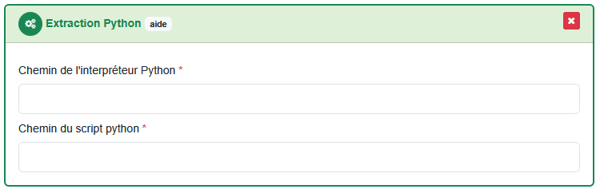

# Set up an extraction using Python

!!! info

    This tutorial uses the extraction plugin `Extraction Python` that allows you to run a custom Python script. A functional Python interpreter for the script (version, dependencies, etc.) must be provided.

To follow along with this tutorial, you can download the sample script and data available [here](https://github.com/asit-asso/extract-samples){target="_blank"}. Either by cloning the repo :

```
git clone https://github.com/asit-asso/extraction-samples.git
```

Or downloading a ZIP archive with the following link : https://github.com/asit-asso/extraction-samples/archive/refs/heads/main.zip

In the subfolder `python`, you will find a Python script example `main.py`, data to extract `inputData.gpkg` and a parameters GeoJSON file example `parameters.json`.

!!! warning

    In addition to Python 3, this example uses a third party OGR2OGR executable. The latter must be installed and available on your system if you want to make the example work.

## Set up the Python script :

1. First we need to import necessary Python packages to run the script. All used packages are provided by the standard python distribution, so ne need to install them.

    ```python
    import subprocess
    import json
    import os
    import sys
    ```

2. Then we setup 2 global variables, the path where the business data to extract are saved and the path of the OGR2OGR executable tu use. All paths can be absolute or relative to the Python script that will be run.

    ```python
    OGR2OGR_PATH = "C:\\OSGeo4W\\bin\\ogr2ogr.exe"
    INPUT_DATA = "inputData.gpkg"
    ```

3. The Python extraction plugin sends all request parameters in a `GeoJSON` file. The path of the latter is given as the first CLI argument when running the python script.

    Therefore, the Python script must retrieve this parameters file by reading the CLI argument and opening and parsing the `GeoJSON` file.

    ```python
    # Get parameters file path from command line argument
    parameters_file = sys.argv[1]

    # Read and parse the parameters.json file
    with open(parameters_file, "r", encoding="utf-8") as json_file:
        parameters = json.load(json_file)
    ```

    Once done, all request parameters are available in the `parameters` variable as a python dictionary.

4. Since our business data are in ``EPSG:2056``, we need to reproject the parameters file from ``EPSG:4326`` to ``EPSG:2056`` in order to use it to clip our data. We will save it as a temporary `clipper.geojson` file in FolderOut.

    ```python
    cmd = [
        OGR2OGR_PATH,
        "-s_srs",
        "EPSG:4326",
        "-t_srs",
        "EPSG:2056",
        os.path.join(
            parameters["properties"]["FolderOut"],
            "clipper.geojson"
        ),
        parameters_file
    ]

    # Run the ogr2ogr command while catching and raising errors
    try:
        subprocess.check_output(cmd)
    except subprocess.CalledProcessError as e:
        print("Processing parameters file failed")
        raise subprocess.CalledProcessError(1, cmd) from e
    ```

5. Before running the last OGR2OGR command, we need to translate the format and projection from the parameters file into the GDAL vocabulary.

    ```python
    # Translate format to OGR format name
    if parameters["properties"]["Parameters"]["FORMAT"] == "GEOJSON":
        format = "GeoJSON"
    elif parameters["properties"]["Parameters"]["FORMAT"] == "GPKG":
        format = "GPKG"
    elif parameters["properties"]["Parameters"]["FORMAT"] == "DXF":
        format = "DXF"

    # Translate Projection to OGR CRS name
    if parameters["properties"]["Parameters"]["PROJECTION"] == "SWITZERLAND95":
        output_proj = "EPSG:2056"
    elif parameters["properties"]["Parameters"]["PROJECTION"] == "SWITZERLAND":
        output_proj = "EPSG:21781"
    else:
        output_proj = "EPSG:2056"
    ```

6. We can now run the final OGR2GR command to extract the data. The command will clip, reproject and save the data into FolderOut.

    ```python
    cmd = [
        OGR2OGR_PATH,
        "-s_srs",
        "EPSG:2056",
        "-t_srs",
        output_proj,
        "-clipsrc",
        os.path.join(
            parameters["properties"]["FolderOut"],
            "clipper.geojson"
        ),
        "-f",
        format,
        os.path.join(
            parameters["properties"]["FolderOut"],
            f"result.{parameters["properties"]["Parameters"]["FORMAT"].lower()}"
        ),
        INPUT_DATA
    ]

    # Run the ogr2ogr command while catching and raising errors
    try:
        subprocess.check_output(cmd)
    except subprocess.CalledProcessError as e:
        print("Processing data failed")
        raise subprocess.CalledProcessError(1, cmd) from e
    ```

7. Finally, we delete the temporary `clipper.geojson` to avoid sending it to the client.

    ```python
    os.remove(os.path.join(
            parameters["properties"]["FolderOut"],
            "clipper.geojson"
        )
    )
    ```

Here is the final Python script :

```python
import subprocess
import json
import os
import sys

OGR2OGR_PATH = "C:\\OSGeo4W\\bin\\ogr2ogr.exe"
INPUT_DATA = "inputData.gpkg"

if __name__ == "__main__":

    # Get parameters file path from command line argument
    parameters_file = sys.argv[1]

    # Read and parse the parameters.json file
    with open(parameters_file, "r", encoding="utf-8") as json_file:
        parameters = json.load(json_file)

    # Reproject the parameters.json to business data CRS (EPSG:2056)
    # and save it as a temporary clipper.geojson file in FolderOut
    cmd = [
        OGR2OGR_PATH,
        "-s_srs",
        "EPSG:4326",
        "-t_srs",
        "EPSG:2056",
        os.path.join(
            parameters["properties"]["FolderOut"],
            "clipper.geojson"
        ),
        parameters_file
    ]

    # Run the ogr2ogr command while catching and raising errors
    try:
        subprocess.check_output(cmd)
    except subprocess.CalledProcessError as e:
        print("Processing parameters file failed")
        raise subprocess.CalledProcessError(1, cmd) from e

    # Translate format to OGR format name
    if parameters["properties"]["Parameters"]["FORMAT"] == "GEOJSON":
        format = "GeoJSON"
    elif parameters["properties"]["Parameters"]["FORMAT"] == "GPKG":
        format = "GPKG"
    elif parameters["properties"]["Parameters"]["FORMAT"] == "DXF":
        format = "DXF"

    # Translate Projection to OGR CRS name
    if parameters["properties"]["Parameters"]["PROJECTION"] == "SWITZERLAND95":
        output_proj = "EPSG:2056"
    elif parameters["properties"]["Parameters"]["PROJECTION"] == "SWITZERLAND":
        output_proj = "EPSG:21781"
    else:
        output_proj = "EPSG:2056"

    # Clip, reproject and save the data in FolderOut
    cmd = [
        OGR2OGR_PATH,
        "-s_srs",
        "EPSG:2056",
        "-t_srs",
        output_proj,
        "-clipsrc",
        os.path.join(
            parameters["properties"]["FolderOut"],
            "clipper.geojson"
        ),
        "-f",
        format,
        os.path.join(
            parameters["properties"]["FolderOut"],
            f"result.{parameters["properties"]["Parameters"]["FORMAT"].lower()}"
        ),
        INPUT_DATA
    ]

    # Run the ogr2ogr command while catching and raising errors
    try:
        subprocess.check_output(cmd)
    except subprocess.CalledProcessError as e:
        print("Processing data failed")
        raise subprocess.CalledProcessError(1, cmd) from e

    # Delete temporary clipper.geojson file
    os.remove(os.path.join(
            parameters["properties"]["FolderOut"],
            "clipper.geojson"
        )
    )
```

To test the script and run it locally, you can use the given example `parameters.json` and run the following command :

```powershell
python main.py parameters.json
```

## Connect the workspace to Extract

1. In Extract, create a new or use an existing process (see [processes](../features/admin-guide.md#processes)).

2. Drag and drop the task plugin `Extraction Python` into the process task list.

3. In the field `Chemin de l'interpréteur Python`, type the path of the Python interpreter you want to use. If you use a virtual environment, you can give the path of the interpreter of the virtual environment, usually something like `.../.venv/Scripts/python.exe`. In the field `Chemin du script python`, type the path of the Python script to run.

    

4. To test the extraction, you can link this process to viageo (see [Connect Extract to viageo.ch](../how-to/extract-viageo.md)). With our example, the linked resource can be orderable over the entire Switzerland in the following format : `geopackage`, `GeoJSON` and `DXF`. 

5. Finally, you can order the linked product on viageo, Extract will retrieve the request and run the FME workspace with all request parameters carried out in the GeoJSON parameters file.

<br>
<br>
<br>
<br>
<br>