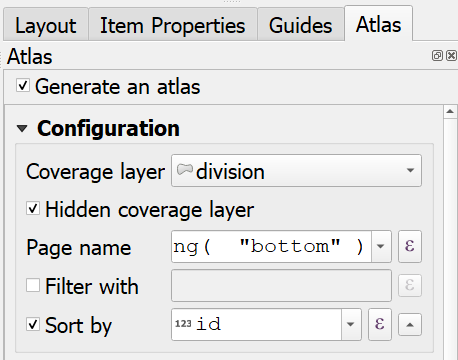
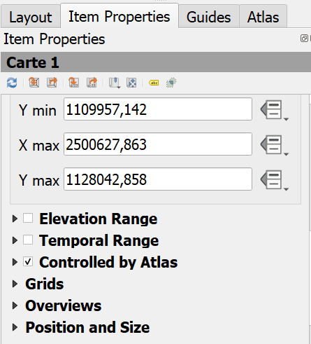
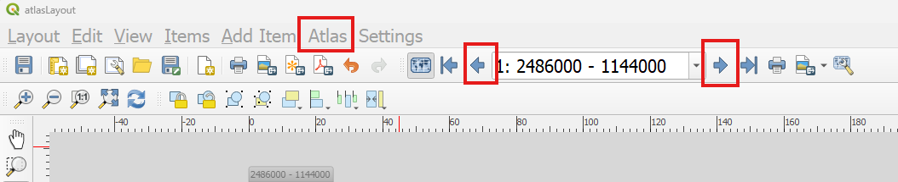
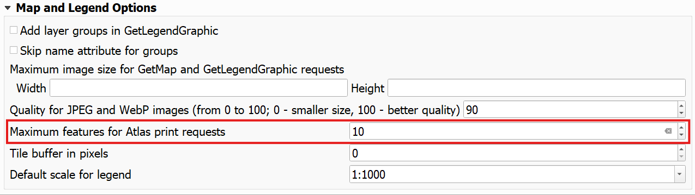
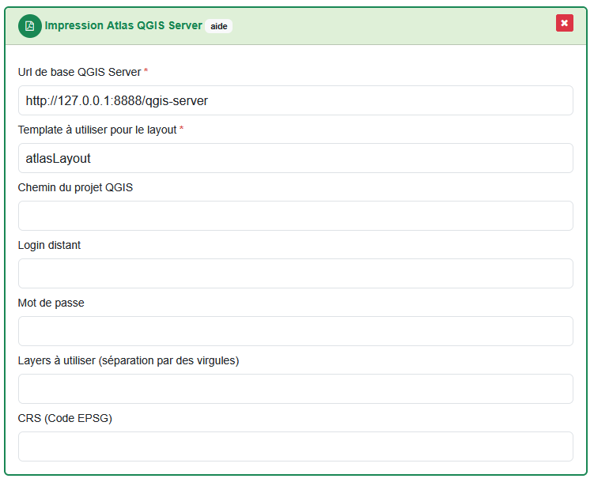

# Set up an extraction using QGIS Server (atlas print layout)

!!! info

    This tutorial uses the extraction plugin `Impression Atlas QGIS Server` which allows you to print out a QGIS project (e.g. in `PDF`) using a standard layout size (e.g. `A4`). Since the plugin uses a `GetPrint` request, the QGIS project must be hosted on a QGIS Server instance. 
    
    The QGIS Atlas tool allows you to use a fixed scale and a fixed layout size by using an additional vector layer containing a grid that will be used to divide your project in multiple files. Hence, when a client request your data, the plugin will intersect the desired perimeter with your grid and print out as many files as needed to cover the request's perimeter. Each file with the fixed layout size and scale.

To follow along with this tutorial, you can download the sample script and data available [here](https://github.com/asit-asso/extract-samples){target="_blank"}. Either by cloning the repo :

```
git clone https://github.com/asit-asso/extraction-samples.git
```

Or downloading a ZIP archive with the following link : https://github.com/asit-asso/extraction-samples/archive/refs/heads/main.zip

!!! warning

    This tutorial uses `Docker` and `Docker compose` to quickly get a running QGIS Server. Of course, you can use your own server.

## Set up the QGIS Project :

1. In the downloaded folder, navigate to `qgis-atlas-server` > `qgis-server` > `data` and open up the QGIS project `sample.qgz`. This project will be hosted on a QGIS Server and be used by the plugin. 

    The project contains only 2 layers, the building footprints from swissTLMRegio and the `Division` layer. The latter is our *grid* layer used by the Atlas tool to divide our project in multiple outputted files.

2. First, we need to create a print layout. In this example, there is already a print layout available (the `atlasLayout` that you can open by going to ``Project`` > ``Layouts`` > ``atlasLayout``). But you can create your own by going to `Project` > `New Print Layout`, give it a name and click `Ok`.

3. In the print compose, you can add a map, legend, scale bar, some labels etc. You can also set up the map scale and layout size and resolution for export. In our `atlasLayout` example, we set the map scale to 1:100'000 and the export resolution to 300 DPI and the layout size to A4 in landscape orientation. We've added a title and other labels and a scale bar.

4. Once you have your layout ready, we need to generate an Atlas. Still in the print compose, go to the Altas tab and check `Generate an Atlas`. 

    Select the `Division` layer as the `Coverage layer`, it will set up this layer as the *grid* layer to export fixed *page* of our project. 
    
    Make sur to check the option `Hidden coverage layer`, it will hide the ``division`` layer in the outputted result.

    You can set up a name for each generated page under `Page name`. In our example, we set it up to `to_string(  "left") + ' - ' +  to_string( "bottom" )`. It uses attributes from the `Division` layer to give the bottom left corner coordinates as page name. 

    Finally, we sort the `Division` layer by its `id` attribute.

    

5. Once the Atlas configuration is set, we need to configure the map to use it. In the print compose, select your map item and go to the `Item Properties` tab and check the option `Controlled by Atlas`.

    

6. Now, we can test it out inside the print composer. Go to the `Atlas menu` and click on `Preview Atlas`. You can now click on the left and right arrow to preview the different pages generated by the Atlas.

    

7. Go back to your QGIS project and make sure that the properties allow to generate more then 1 feature for Atlas print request. Go to `Project` > `Properties` > `QGIS Server` > `WMS` tab and under `Map and Legend Options`, adapt the number next to `Maximum features for Atlas print request` (e.g. 10).

    

7. Now that our print layout using the Altas tool is ready, we can publish our QGIS project in QGIS Server. If you have docker installed and running, you can simply do a `Docker compose up` being at the root of the `qgis-atlas-server` folder.

    When all containers are running, we can test an export by calling the following URL in a browser :

    ```
    http://127.0.0.1:8888/qgis-server?SERVICE=WMS&REQUEST=GetPrint&CRS=EPSG:2056&TEMPLATE=atlasLayout&FORMAT=pdf&ATLAS_PK=122,123,124,125
    ```

    This will export 4 PDF pages corresponding to the id `122`, `123`, `124` and `125` of the `Division` layer.

## Connect the workspace to Extract

1. In Extract, create a new or use an existing process (see [processes](../features/admin-guide.md#processes)).

2. Drag and drop the task plugin `Impression Atlas QGIS Server` into the process task list.

3. In the field `Url de base QGIS Server`, type the URL of your QGIS Server instance. In our example using Docker, you can type `http://127.0.0.1:8888/qgis-server`. In the field `Template à utiliser pour le layout`, you need to give the print layout name using the Atlas tool. In our example, this is the `altasLayout`.

    

4. To test the extraction, you can link this process to viageo (see [Connect Extract to viageo.ch](../how-to/extract-viageo.md)). With our example, the linked resource can be orderable over the entire Switzerland. The format does not really matter and won't be read by Extract or QGIS. But the plugin will always export files in PDF. So, for clarity for the clients, the format must be set to PDF in viageo.ch. 

5. Finally, you can order the linked product on viageo, Extract will retrieve the request and call the GetPrint request of your QGIS Server.

<br>
<br>
<br>
<br>
<br>