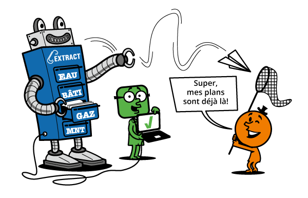
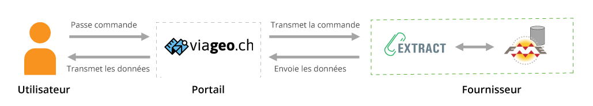

## What is Extract ?

<h3 style="color: var(--primary-color);">Extract is a web application that facilitates the extraction and delivery of your geodata !</h3>

The Extract application **imports data requests** from a platform or data portal (such as the ASIT portals viageo.ch and plans-reseaux.ch), then executes a series of pre-configured tasks to **extract the requested data**, then returns the given result back to the client. 

And all of that with or without human intervention, you choose it !

## Key features

*  :material-reload: Automate the process of extracting, transforming and delivering your geodata
*  :material-truck-fast: reduce order processing times
*  :high_brightness: increase delivered data quality
*  :smiling_face_with_3_hearts: increase customer satisfaction

## Open Source project

Extract is a modular and extensible web application, **to be installed in the IT environment of each data provider**, and can be accessed with a web browser.

 
 
 
 
 