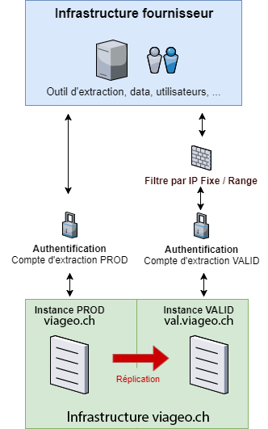

# viageo.ch Validation Instance
!!! Warning 
    This section is only useful if your organization provides geodata on the platform [viageo.ch](https://viageo.ch){target="_blank"} or [plans-reseaux.ch](https://plans-reseaux.ch){target="_blank"}. You must be an [ASIT](https://asit-asso.ch){target="_blank"} member to distribute geodata through these platforms.

## Fundamentals

The viageo.ch portal consists of two separate environments:

* A production instance (PROD) : **[https://viageo.ch](https://viageo.ch){target="_blank"}** This is available to all users 24/7 (except exceptional maintenance)
* A validation instance (VAL) : **[https://val.viageo.ch](https://val.viageo.ch){target="_blank"}** 
    Its operation is not guaranteed at all times. It is only available to suppliers (ASIT members) for testing purposes. The sending of notification emails is disabled.

## Request for access to the validation instance

Access to the validation instance is restricted by IP address.

Please send any access requests to support@viageo.ch, specifying the public IP address (single or range) of the hosts that will need to access it (your workstation, the server where EXTRACT will be installed, etc.).

## Data replication between instances

Occasionally, data from the **production** instance is replicated to the **validation** instance. All your resources will then be updated and replaced with production data.

{width="300"}